<div align="center">

<picture>
  <source media="(prefers-color-scheme: dark)" srcset="docs/images/logo-dark.png">
  
</picture>

**Test your trading idea before your money does.**

**For investors:** understand any Indian company from its own filings: ten years of numbers, the business in its own words, the measures its industry is judged on, how it's valued, red flags, and whether management delivered what it promised. Scan for Stage 2 stocks and see which sectors lead.

**For traders:** describe a strategy in plain English, test it honestly on Indian, US, UK, European and Japanese stocks, forex, crypto or commodities (MCX and global), then paper trade it on live prices with fake money.

One question when you sign up (investing, trading or both) puts what you came for first.

### [🌐 stratlab.studio](https://stratlab.studio)


</div>

<picture>
  <source media="(prefers-color-scheme: dark)" srcset="docs/images/verdict-dark.png">
  
</picture>

<picture>
  <source media="(prefers-color-scheme: dark)" srcset="docs/images/investor-start-dark.png">
  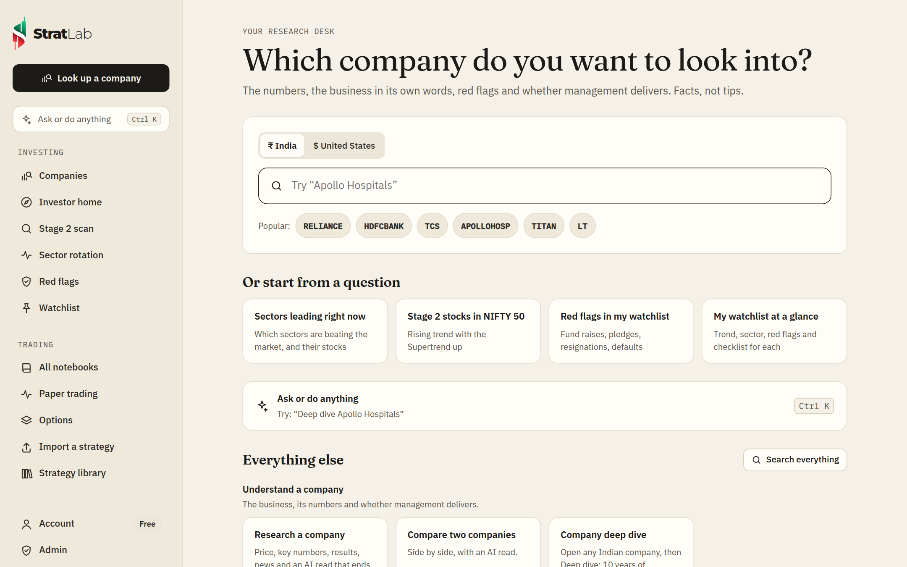
</picture>

## What makes it different

Most backtesting tools show a flattering chart. StratLab tells you whether the edge is **real or luck**.

- **A verdict on every experiment.** Each test ends in one plain answer: *Likely a real edge*, *Mixed evidence*, *Probably luck*, *Not enough evidence* or *No edge here*. Four checks back it up:
  - **Unseen data:** the rules are tested separately on the last 30% of the period, which they were never tuned on.
  - **Nearby settings:** 25 variations of your indicator lengths. If only your exact numbers make money, that's a lucky fit.
  - **Bad-luck drawdown:** your trades reshuffled 1,000 times, to show how deep the losses could realistically get.
  - **Enough trades:** under 15 trades, luck dominates.
- **Two deeper checks, one tap each.**
  - **Walk-forward test:** re-tunes your settings on a stretch of the past, trades them on the next stretch the tuning never saw, slides forward and repeats. It shows what re-tuning as you go would really have earned, without hindsight.
  - **Does it work on similar stocks?** Runs the same rules on about 10 similar instruments from the same market. Real patterns travel; lucky charts don't.
- **Real costs, in the market's own currency.** India: STT, exchange and SEBI fees, stamp duty, GST, plus a capital-gains estimate. US: SEC and FINRA fees. UK: stamp duty on share buys. Forex: the spread. Crypto: exchange fees. MCX commodities: CTT on sells, MCX fees, stamp duty and GST. Global commodities: a spread and commission estimate. Slippage on every fill. You see what you'd actually keep.
- **Lab notebooks.** Each idea is a notebook: a question, the rules written as sentences, numbered experiments you can compare side by side, and your own lab notes.
- **A full toolkit.** Buy, sell short, or trade both ways with separate long and short rules. Stops in %, points, ATR or the recent swing low/high; targets in %, points or R-multiples; trailing stops and time limits. 20+ indicators (moving averages, RSI, MACD, Bollinger Bands, VWAP, Supertrend, ADX, Stochastic, ATR, Donchian, volume) plus the candle itself (open, high, low, body, wicks, range) and the trading day (previous close, day open/high/low, day change %). Any value can be taken N candles ago, multiplied, or computed on a higher timeframe.
- **Options, live.** A separate Options tab paper trades straddles, strangles, iron flies, condors, spreads or any structure up to 8 legs on live NSE, BSE and MCX option quotes, filling at the real bid and ask. Entries come at a set time or whenever a notebook's own rules signal: a 7 EMA cross can buy the ATM NIFTY call, and a short signal the put. It covers MTM stops and targets, trailing, per-leg stops, daily caps, re-centring, margin-based sizing and freeze-limit slicing. Options backtesting is coming: StratLab now records NIFTY, BANKNIFTY and SENSEX option chains every 5 minutes to build the price history it needs.
- **Test on a whole group.** Run the rules on a ready-made group (NIFTY 50, Bank NIFTY, liquid F&O stocks, US mega caps, large coins) or your own list of up to 50, sharing one pot of capital with a limit on positions open at once. The verdict breaks the result down member by member. Paper trading an Indian group can enter on the live price instead of waiting for the candle to close, and skip stocks whose bid-ask spread is too wide.
- **Built for intraday.** An entry window, a square-off time, a cap on trades per day, a cooldown after each trade and a daily loss cap. Entry rules can be combined as a weighted conviction score. Size by risk or by fixed capital per trade with leverage; Indian intraday trades use MIS costs.
- **Any market.** Indian stocks, indices and F&O on a live exchange feed; US, UK, European and Japanese stocks and ETFs, forex and crypto; or upload a CSV of candles from anywhere. No extra keys needed.
- **Commodities, as two separate markets.**
  - **Indian commodities (MCX):** gold, gold mini and petal, silver, silver mini and micro, crude oil and crude mini, natural gas and its mini, copper, zinc, aluminium, lead.
    - Rupees, whole lots (one GOLDM lot is 100 g, so 10 times the quoted price per 10 g).
    - Costs: CTT 0.01% on sells, MCX fees, stamp duty, GST.
    - Hours 9:00 am to 11:30 pm IST, NSE holiday calendar.
    - Daily history is stitched across expiries for years of data; intraday history covers only the current contract.
    - Paper sessions trade the front-month contract, which rolls 3 days before expiry.
  - **Global commodities:** COMEX, NYMEX, CBOT and ICE front-month futures: gold, silver, platinum, copper, WTI and Brent crude, natural gas, corn, wheat, soybeans, coffee, sugar, cocoa, cotton.
    - Dollars (grain prices in cents are converted), sized per ounce, barrel or bushel rather than per exchange contract.
    - A spread and commission estimate per side.
    - Sunday 6 pm to Friday 5 pm New York, US holiday calendar.
- **Research built in.** Company pages for India and the US: live price and chart, valuation and growth with context, sales and profit history, results against estimates, who owns it, insider trades, news, and an AI read whose trading ideas open as a notebook in one click. Plus AI theme maps, a daily market pulse, side-by-side comparisons and a watchlist.
- **For investors, not just traders.** The **Investing** section of the menu has every tool one tap away, and investors get their own home page: "Which company do you want to look into?"
  - **Company deep dive (India):** ten years of sales, profit, margins, capex and free cash flow; the business model and every capex plan read from the company's own investor presentations and call transcripts. Every quote is checked against the document it's credited to, and anything that can't be found there is dropped. Transcripts the company only links to from its own website are fetched from there.
  - **Industry-aware:** banks, insurers, holding companies, real estate, power and telecom, and cyclicals each get rules that fit them. Each industry's own measures (revenue per occupied bed and occupancy for hospitals, NIM and NPAs for banks, RevPAR for hotels, ARPU for telecom, EBITDA per tonne for cement and metals) are pulled from the company's documents, with the quote.
  - **How it's valued:** EV/EBITDA for asset-heavy businesses, price to book for lenders, insurers and developers, P/E for the rest, always with P/E alongside.
  - **Management report card:** the targets management gave on up to six earnings calls over two years, each checked against the reported results: met, missed or not due yet, with the quote and the call. "This year" and "next year" are resolved to the right financial year; analysts' numbers never count.
  - **Investor checklist:** fixed, written-down pass / watch / fail checks on trend, growth, return on capital or equity, margins, debt, cash conversion, promoter holding, filings and management's record.
  - **Investor home and deck:** every watchlist company on one page (trend, sector, red flags, checklist, report card), and any deep dive as a PowerPoint deck.
  - **Stage 2 + Supertrend scan (ST S2):** which stocks in your watchlist or a ready-made group are in Weinstein's Stage 2 with the Supertrend up, fresh signals first, with a daily alert and a one-click backtest of the ST S2 rules on the whole group.
  - **Sector rotation:** every sector against the market, as Leading, Weakening, Lagging or Improving, with the trail it took. Click a sector to see its biggest stocks against it. NSE sectors, size and style indices, S&P 500 sectors and US industries.
  - **Filings and red flags (India):** fund raises (QIP, preferential, rights, warrants), promoter pledges, auditor and director resignations, defaults, regulator action and rating downgrades, each linked to the filing, with an evening alert.
- **Plain-English builder.** Describe the idea; the AI turns it into rules and asks only about what you left out. It tries several free AI services in turn (Groq, Cerebras, Gemini, Mistral, SambaNova, OpenRouter), with Claude as an optional paid fallback, and a simple built-in converter if all of them are down.
- **Import any strategy.** One **Import a strategy** page takes a config file, Pine Script, Python, MetaTrader, AmiBroker, a StratLab export or plain words. It sets up the right thing: a notebook for rules on one instrument, a group notebook for strategies that scan a list (like an F&O momentum scanner), or an Options structure. Anything that can't be carried over is listed.
- **Paper trading in every market.** Run the rules on live prices with fake money: India, the US, UK, Europe, Japan and forex during their market hours, crypto around the clock. A single instrument, a whole group with shared capital, or an option structure. Sessions keep running until you stop them. With alerts on, each trade comes as a phone notification, on Telegram or by email, plus a short report a few minutes after each market closes.
- **Share a verdict.** A card with the equity chart, all four checks and the numbers, sent straight from your phone's share menu, or a public link anyone can open without an account. It previews in WhatsApp, X and LinkedIn, shows the verdict but never your rules, and turns off with one tap.

<picture>
  <source media="(prefers-color-scheme: dark)" srcset="docs/images/walkforward-dark.png">
  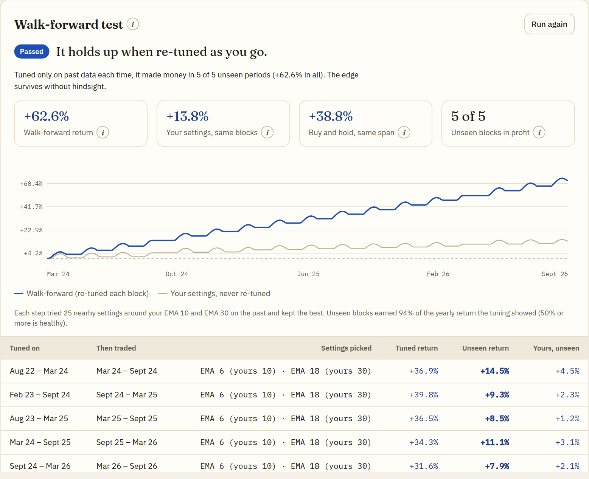
</picture>

<picture>
  <source media="(prefers-color-scheme: dark)" srcset="docs/images/notebook-dark.png">
  
</picture>

<picture>
  <source media="(prefers-color-scheme: dark)" srcset="docs/images/options-dark.png">
  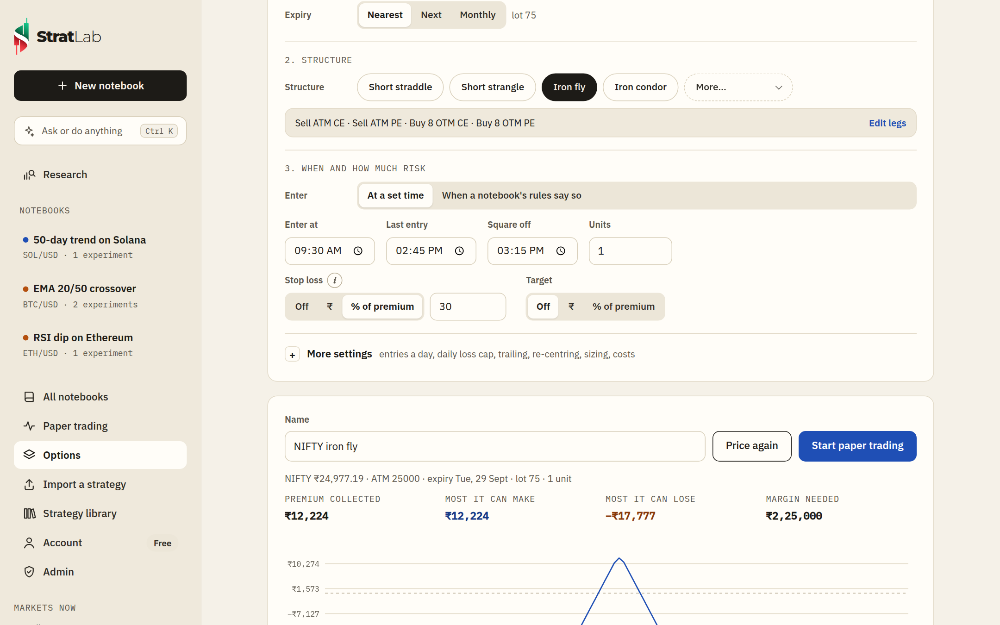
</picture>

<picture>
  <source media="(prefers-color-scheme: dark)" srcset="docs/images/import-dark.png">
  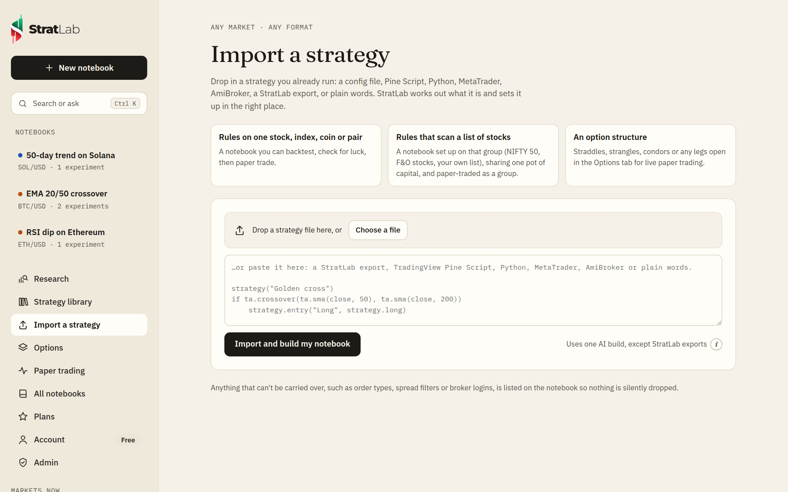
</picture>

<picture>
  <source media="(prefers-color-scheme: dark)" srcset="docs/images/deepdive-dark.png">
  
</picture>

<picture>
  <source media="(prefers-color-scheme: dark)" srcset="docs/images/reportcard-dark.png">
  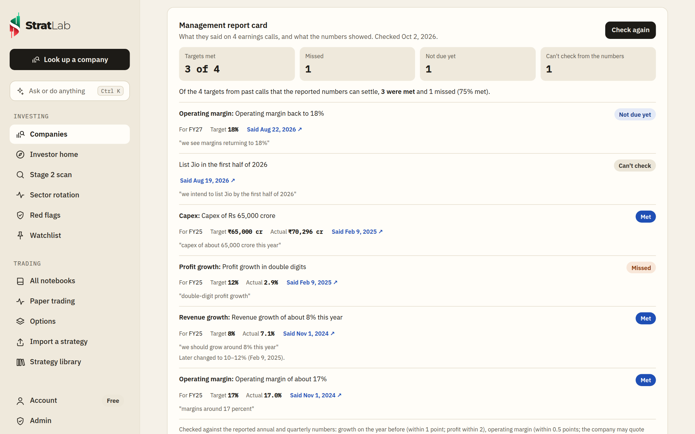
</picture>

<picture>
  <source media="(prefers-color-scheme: dark)" srcset="docs/images/rotation-dark.png">
  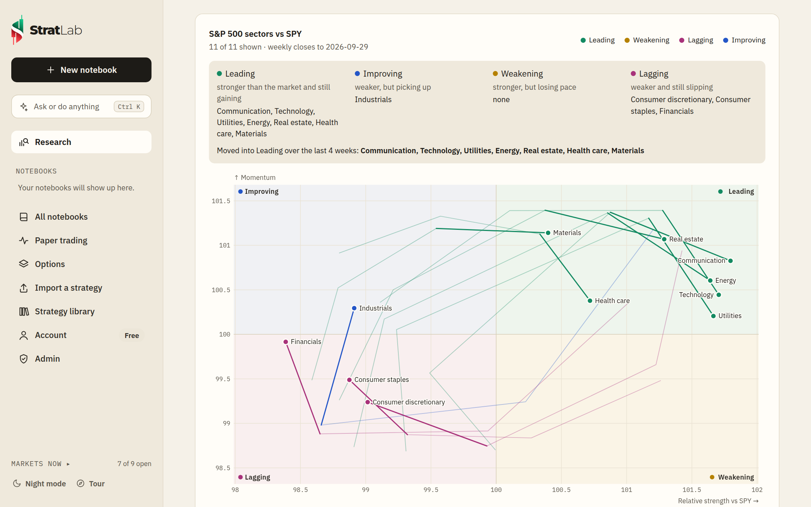
</picture>

<picture>
  <source media="(prefers-color-scheme: dark)" srcset="docs/images/scan-dark.png">
  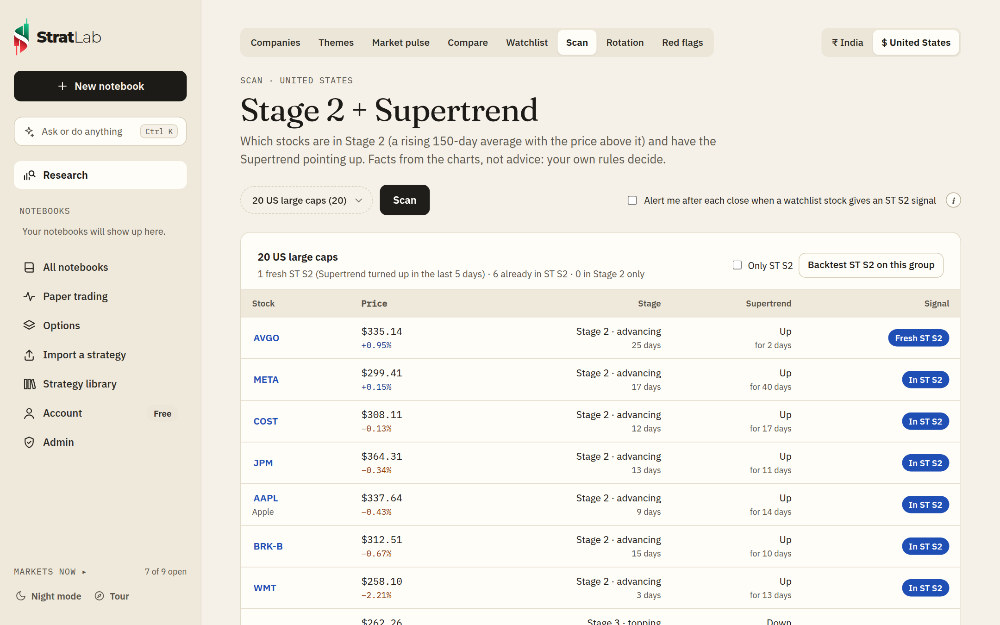
</picture>

<picture>
  <source media="(prefers-color-scheme: dark)" srcset="docs/images/filings-dark.png">
  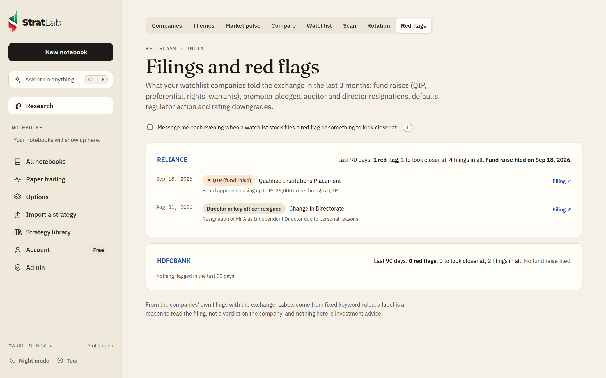
</picture>

<picture>
  <source media="(prefers-color-scheme: dark)" srcset="docs/images/research-dark.png">
  
</picture>

<picture>
  <source media="(prefers-color-scheme: dark)" srcset="docs/images/search-dark.png">
  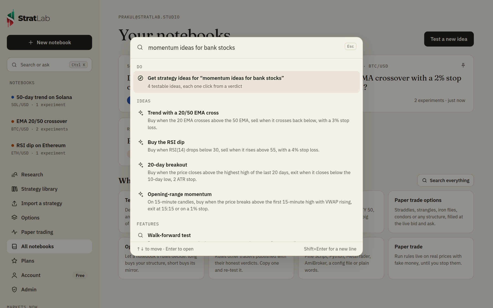
</picture>

<picture>
  <source media="(prefers-color-scheme: dark)" srcset="docs/images/library-dark.png">
  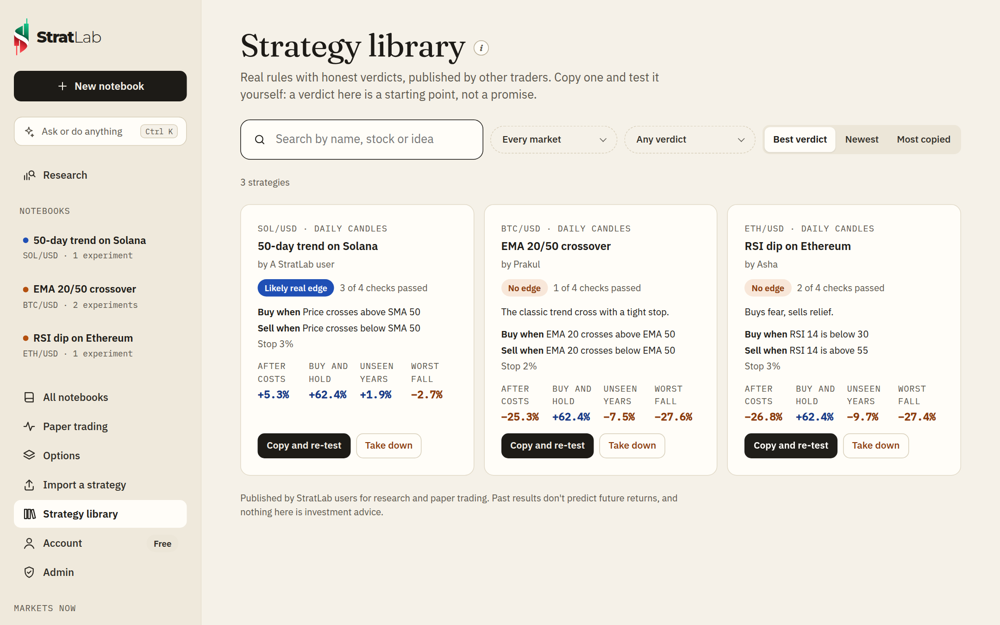
</picture>

## Everything you can do, and where to find it

New here? A short tour pops up the first time you sign in. You can reopen it any time from **Tour** at the bottom of the sidebar. **Markets now** at the bottom of the sidebar shows how many markets are open; tap it to list each one, and hover (or tap) a market to see when it opens or closes: it says **weekend** or **holiday** when an exchange is shut.

<picture>
  <source media="(prefers-color-scheme: dark)" srcset="docs/images/tour-dark.png">
  
</picture>

| You want to… | Where it is |
| --- | --- |
| Find an idea | **Investing → Companies** in the menu: a company's AI read ends with ideas to test in one click |
| Explore a sector | **Research → Themes**: a map of who's involved, where the margin sits, and a ranked shortlist |
| See the market's mood | **Research → Market pulse**: index levels, headlines and an AI read of what's moving |
| Keep an eye on companies | **Watch** on a company page; they're listed under **Investing → Watchlist** |
| Find Stage 2 stocks with the Supertrend up | **Investing → Stage 2 scan**: your watchlist or a ready-made group; **Backtest ST S2 on this group** makes a notebook in one click, and the checkbox turns on a daily alert (Pro) |
| See which sectors are leading | **Investing → Sector rotation**: sectors, size and style indices or US industries, weekly or daily, with a trail and **Animate**; **Stocks →** on a sector shows its biggest stocks against it (Pro) |
| Check a company's filings for red flags | **Investing → Red flags** for your India watchlist, or **Filings and red flags** on any Indian company page; tick the box for an evening alert (Pro) |
| Understand a company's business and its capex plans | On any Indian company page, **Deep dive: business, capex, management**; **Read the documents** has the AI read its latest presentation and call transcripts; **Check past calls** builds the management report card; **Download as slides** gives a PowerPoint deck (Pro) |
| See the whole watchlist the investor way | **Investing → Investor home**: trend, sector rotation, red flags, checklist and report card for each India watchlist company (Pro) |
| Test a new idea | **New notebook**: pick the market first, then describe the idea or start from a classic one |
| Bring a strategy you already have | **Import a strategy** in the sidebar (or on New notebook): it sets up a notebook, a group notebook or an Options structure depending on what you bring; a StratLab export, TradingView Pine Script, Python, MetaTrader, AmiBroker or plain words |
| Keep favourites at the top | **Pin** on a notebook (or the pin on its card); pinned notebooks lead the sidebar and the list |
| Find a notebook | Search and sort (recent, name, best verdict) on **All notebooks**; the dot beside each name in the sidebar is its last verdict |
| Try a variation without losing the original | **More → Make a copy** at the top of a notebook (Export and Delete are there too) |
| Rename a notebook | Click its name at the top of the notebook |
| Choose or change the market | Step 1 on a new notebook, or the **Testing on** button at the top of any notebook |
| Rewrite the idea from scratch | **Describe the idea again** at the top of a notebook |
| Tweak a rule | Tap any highlighted word (marked ▾) in **The rules**: indicator, length, condition or number. The **×** at the end of a rule removes it; **+ Add** under Entry or Exit adds one |
| Rewrite the whole strategy | **Edit in words** on **The rules**: describe it again and the rules are rebuilt, keeping the market and capital |
| Fine-tune (trailing stop, time limit, intraday limits, costs, sizing) | **More settings** at the bottom of **The rules**. It stays closed until you open it, remembers, and shows how many are switched on |
| Run a test | **Run experiment** in a notebook (or press Ctrl/⌘ + Enter); each run is saved and numbered so you can compare |
| Short instead of buy, or trade both ways | Tap **Buy** at the start of the rules and pick **Sell short** or **Trade both ways** |
| Trade intraday | Pick 5- or 15-minute or 1-hour candles; a **During the day** line appears for the entry window, square-off, trades a day, cooldown and daily loss cap |
| Use the candle's shape, an earlier candle or a higher timeframe | Tap a value in a rule → **More**: candles ago, multiply by, timeframe |
| Score your entry conditions | Tap **all of these** and pick **enough of these**: each rule gets a weight and the trade needs a minimum score |
| Trail the stop or cap how long a trade lasts | The **Trail the stop by … and close any trade after …** line in **The rules** |
| Compare two runs | **Compare experiments →** in a notebook, or **Compare with the previous run** on a verdict |
| Check a tuned idea without hindsight | **Walk-forward test** on a verdict: re-tunes on the past, trades the next unseen stretch, and repeats |
| Check it isn't one lucky chart | **Does it work on similar stocks?** on a verdict runs the same rules on about 10 similar instruments |
| Understand a number | Every check, stat and setting has an **(i)** button that explains it in plain words |
| Decide what to do next | The **Next** bar on a verdict: change the rules, try another market, paper trade, write a lab note |
| Test on a whole group of stocks | **Testing on → Or test on a group**: a ready-made group (NIFTY 50, Bank NIFTY, F&O stocks, US mega caps, large coins) or your own list, with a limit on positions open at once; **Paper trade** runs the whole group live on intraday candles. For Indian groups you can turn on **faster entries** (enter on the live price instead of waiting for the candle to close) and a **spread limit**, and for any group a **minimum price** |
| Paper trade options | **Options** in the sidebar: pick the underlying, expiry and structure, press **Price it now** for live fills, payoff and margin, then **Start paper trading**; three steps (what to trade, structure, when and risk); re-centring, trailing, caps, sizing and costs are under **More settings** |
| Trade options on your own signal | On **Options**, set **Enter** to **When a notebook's rules say so** and pick a notebook with rules on 5-minute, 15-minute or hourly candles, for example a 7 EMA crossover. When the rules go long it enters your structure (say, buy the ATM NIFTY call); when they go short it can enter the mirror (buy the put); when they exit, it closes |
| Paper trade | **Paper trade** at the top of a notebook or verdict; running sessions are under **Paper trading** |
| Share a result | **Share verdict** on a verdict: send the card (chart, the four checks, the numbers) straight to an app on your phone or save it on a computer, or **Make a public link**: a read-only page anyone can open without an account. It shows the verdict, not your rules, and you can turn it off at any time |
| Save the rules | **Export** in a notebook saves the rules as a file |
| Put investing or trading first | **Account → What you're here for**: Investing, Trading or Both (asked once when you sign up). It orders the menu, the home page and the examples; nothing is hidden |
| Set how much is shown up front | **Account → Experience**: New to trading, I've traded a bit, or I trade actively. It changes only what starts open; every tool stays available |
| See all your paper trading at once | **Paper trading** shows **All running sessions** on top: open position value, today, total P&L, the worst day and the deepest fall for everything together, per currency, with each session's share |
| Borrow a strategy, or share yours | **Strategy library** in the sidebar: rules other traders published with their honest verdict (luck included). **Copy and re-test** puts them in a notebook of your own. Publish yours from a verdict: **Share verdict → Publish to the strategy library** |
| Ask or do anything | **Ask or do anything** at the top of the sidebar or on your home page, or **Ctrl+K** (⌘K) anywhere. Type a line and press Enter: "deep dive Apollo Hospitals", "which sectors are leading?", "red flags in my watchlist", "Stage 2 stocks in NIFTY 50" and "compare TCS and Infosys" open the right page; "Test: buy NIFTY when RSI drops below 30" builds the rules and shows the verdict, "paper trade an EMA cross on BTC" starts paper trading, "research HDFC Bank" opens research, "what is walk-forward?" is answered in place, "momentum ideas for banks" gives testable ideas. Pasting a strategy imports it |
| See your plan or upgrade | **Account → Plan and usage** (Plans lives inside Account) |
| Put it on your phone | **Account → On your phone**: install StratLab to the home screen (its own icon, full screen) and **Turn on notifications** to get trade alerts and the daily report on that device, no Telegram needed. On an iPhone, first Share → Add to Home Screen |
| Check that everything's connected | **Account → Connection check** shows market data and each AI provider |
| Read at night | **Night mode** at the bottom of the sidebar |

<picture>
  <source media="(prefers-color-scheme: dark)" srcset="docs/images/new-dark.png">
  
</picture>

<picture>
  <source media="(prefers-color-scheme: dark)" srcset="docs/images/landing-dark.png">
  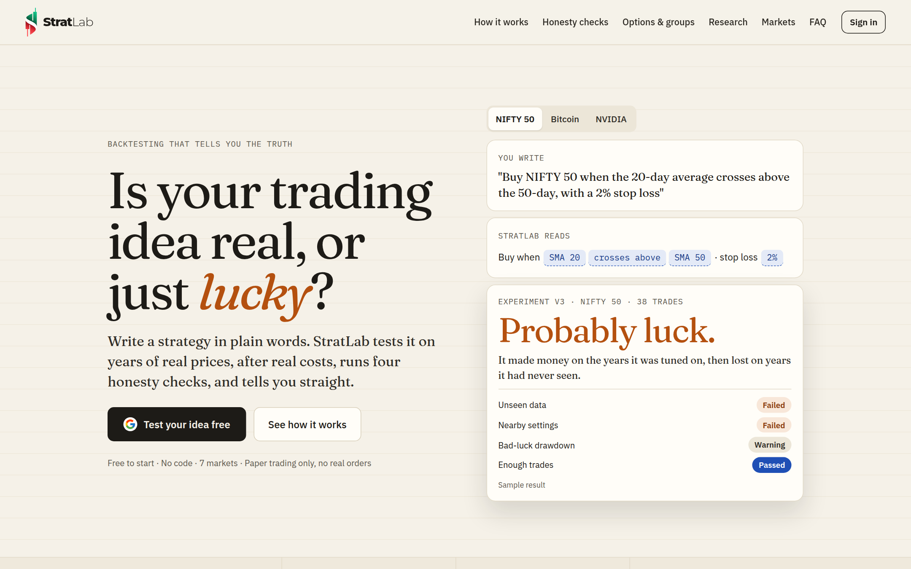
</picture>

<sub>Screenshots use synthetic sample prices, not real market data.</sub>

## How it works

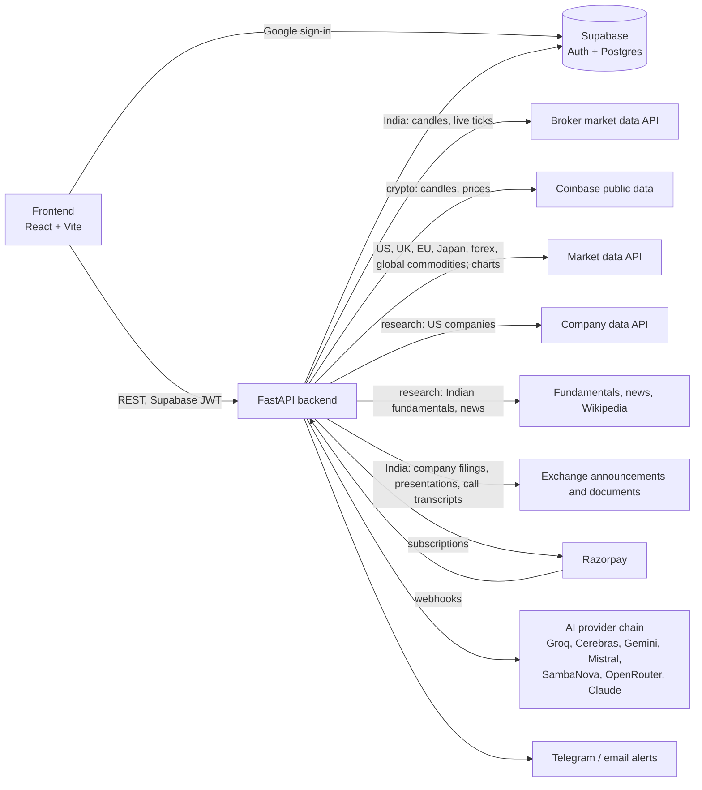

The browser only talks to the backend. The backend owns every secret: the Supabase service key, broker and Razorpay credentials, and the AI keys. Backtests, verdict checks and live paper trading all use the same engine, so a strategy behaves the same everywhere.

## Repository layout

```
stratlab/
├── backend/                  FastAPI app (deploys to Railway)
│   ├── app/
│   │   ├── main.py           API routes
│   │   ├── engine/
│   │   │   ├── core.py       rule evaluation and the trading engine
│   │   │   ├── indicators.py SMA, EMA, RSI, MACD, Bollinger, VWAP, Supertrend, ADX, Stochastic, Donchian
│   │   │   ├── costs.py      per-market trading costs and tax estimates
│   │   │   ├── verdict.py    the four honesty checks and the verdict
│   │   │   ├── portfolio.py  group tests: one pot of capital across many instruments
│   │   │   └── walkforward.py walk-forward test: re-tune on the past, trade the unseen next block
│   │   ├── options/          Options tab: contracts, chains, quotes and margin; the options engine and sessions
│   │   ├── universes.py      ready-made groups of stocks and coins
│   │   ├── group_live.py     paper trading a whole group with one pot of capital
│   │   ├── basket.py         "does it work on similar stocks?": same rules on ~10 similar instruments
│   │   ├── data/             market data: markets list, one provider per market (India, MCX, crypto, US, UK, EU, Japan, forex, global commodities), holidays
│   │   ├── intel/            research: company data, fundamentals, news, Wikipedia, AI reads, exchange filings and red flags, /research API
│   │   ├── scan.py           Stage 2 + Supertrend (ST S2) scans, the ready-made ST S2 strategy and its daily alert
│   │   ├── deepdive.py       company deep dive: 10-year numbers and capex, AI reads of presentations and call transcripts
│   │   ├── docs.py           downloads exchange-filed PDFs (exchange hosts only, size-capped) and cuts them to the passages that matter
│   │   ├── report_card.py    management report card: targets from past earnings calls checked against reported results
│   │   ├── checklist.py      the investor checklist: fixed pass / watch / fail rules
│   │   ├── investor.py       the investor home: one row per watchlist company
│   │   ├── deck.py           the deep dive as a PowerPoint deck
│   │   ├── fixtures.py       the admin's real-price snapshot for tests
│   │   ├── rotation.py       sector rotation: relative strength and momentum against a benchmark, with trails
│   │   ├── sector_members.py the biggest stocks in each sector index and sector fund, for drilling into a sector
│   │   ├── research.py       load candles, run an experiment, keep a compact record
│   │   ├── live.py           paper trading on live ticks (India) or polled candles (every other market)
│   │   ├── kite_service.py   the broker data API: login, candles, live ticks
│   │   ├── kite_auto.py      optional automatic daily broker login
│   │   ├── admin.py          owner-only admin page API
│   │   ├── billing.py        Razorpay subscriptions
│   │   ├── plans.py          plan limits and prices, and the admin-started launch offer
│   │   ├── library.py        the public strategy library, with reports and moderation
│   │   ├── guard.py          request size cap, rate limits and security headers
│   │   ├── ai_writer.py      plain English → strategy rules
│   │   ├── ai_providers.py   the AI provider chain and its order for quick jobs and research reads
│   │   ├── push.py           phone and browser notifications (Web Push)
│   │   └── alerts.py         phone, Telegram and email alerts
│   ├── tests/                pytest suite
│   └── .env.example          every setting the server reads
├── frontend/                 React + TypeScript app built with Vite (deploys to Vercel)
│   ├── public/               config.js (API URL, Supabase public key), favicon, app icons, link-preview image
│   └── src/
│       ├── pages/            notebook, verdict, markets, research, paper trading, options, plans, account, admin
│       ├── components/       rules editor, charts, sidebar, feature tour, logo, share image
│       └── lib/              API client, formatting, rule parser, CSV import, (i) help texts, brand
└── supabase/
    └── schema.sql            tables, row-level security, sign-up trigger
```

## Quick start

```bash
# backend
cd stratlab/backend
python -m venv .venv && source .venv/bin/activate
pip install -r requirements.txt
cp .env.example .env          # fill in Supabase, broker, Razorpay and AI keys
uvicorn app.main:app --reload --port 8000

# frontend (in another terminal)
cd stratlab/frontend
npm install
npm run dev                   # open http://localhost:5500
```

Run the tests with `cd stratlab/backend && pytest`, and check the frontend with `cd stratlab/frontend && npm run build`.

The **[setup guide](stratlab/README.md)** covers Supabase, the broker data API (including the automatic daily login), Razorpay, the AI writer, deployment, and how the engine and the verdict work.

## Plans

Paid plans switch on once Razorpay's keys and plan IDs are set; until then every feature is open to everyone, with the Free plan's monthly limits. The site owner can also start a **launch offer** from the Admin page: every user gets Pro free for a set number of days.

| | Free | Basic · ₹999/mo | Pro · ₹2,999/mo |
|---|---|---|---|
| Yearly (two months free) | – | ₹9,990 | ₹29,990 |
| Experiments (each with a full verdict) | 5 / month | 50 / month | Unlimited |
| AI strategy builds | 10 / month | 100 / month | Unlimited |
| Group tests | Up to 10 instruments | Up to 25 | Up to 50 |
| Paper trading | 5-market-day trial, 1 session | 2 at a time | 10 at a time |
| Group paper trading | – | ✓ | ✓ with faster entries and a spread limit |
| Options paper trading | – | At set times | At set times or on a notebook's signal |
| Daily report after the close | – | ✓ | ✓ |
| Phone, Telegram and email alerts for every trade | – | – | ✓ |
| Indicators | Price, SMA, EMA, RSI | Price, SMA, EMA, RSI | All 20+ |
| Markets | All, except Indian F&O | same | + Indian F&O |
| Export rules and trades | – | – | ✓ |
| ST S2 scan, sector rotation, filings and red flags, company deep dive, management report card, investor checklist, investor home, company deck | – | – | ✓ |
| Research AI reads | 60 / day | 60 / day | 60 / day |
| Share cards and public links | ✓ | ✓ | ✓ |

Limits live in [`plans.py`](stratlab/backend/app/plans.py) and are enforced on the server.

## What's new

See the [changelog](CHANGELOG.md) for what has shipped and the [roadmap](docs/ROADMAP.md) for what is planned and the known gaps.

## Disclaimer

StratLab is a research and paper trading tool. It places no real orders and gives no investment advice, and past backtest results don't predict future returns.

## License

Proprietary. © 2026 Prakul Bansal. All rights reserved. See [LICENSE](LICENSE).
