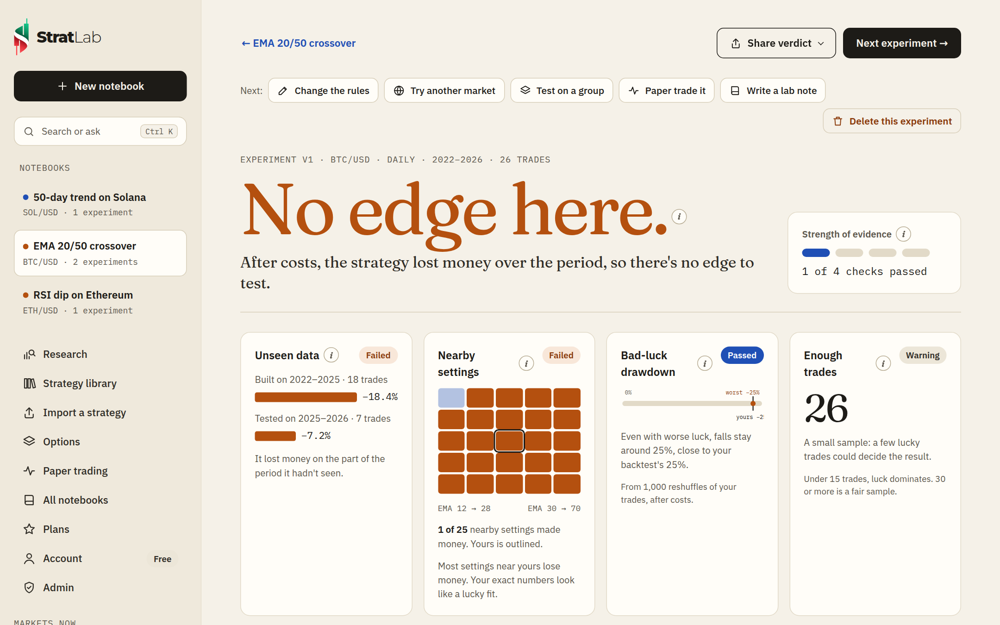
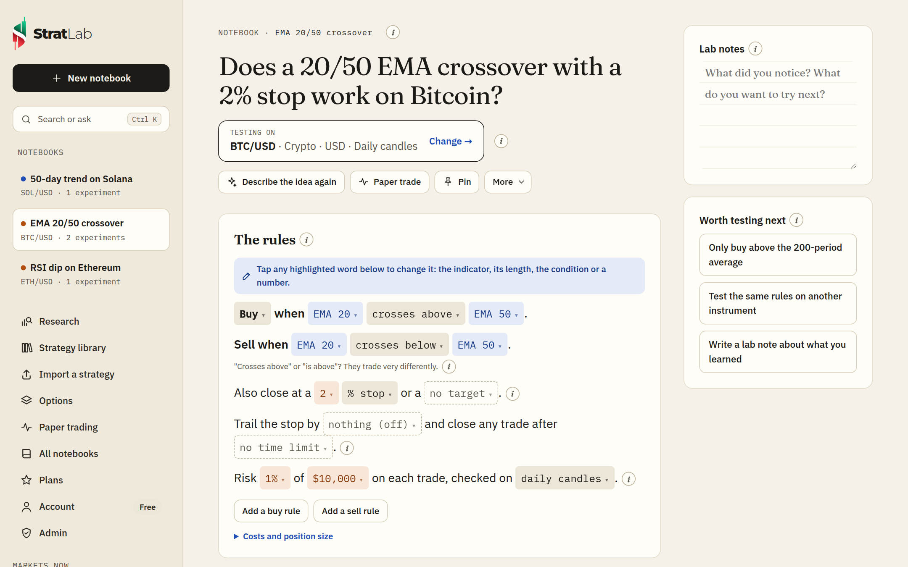
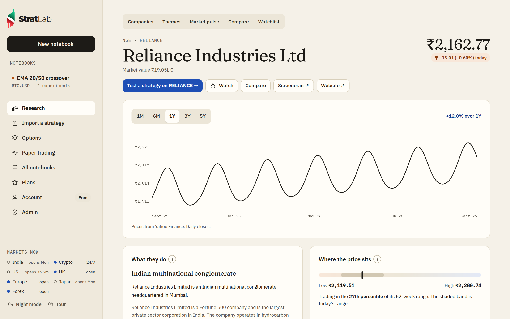
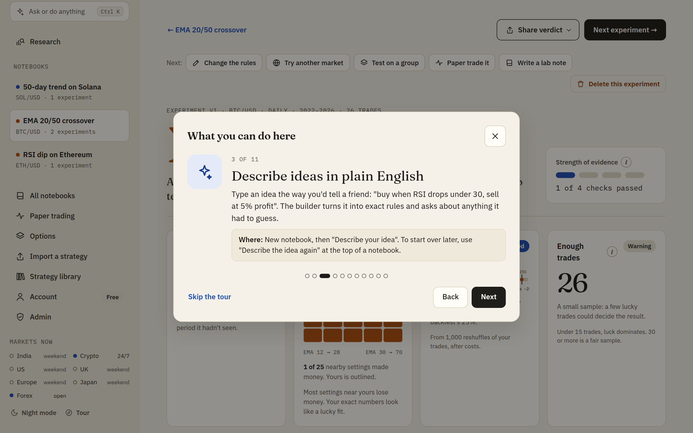
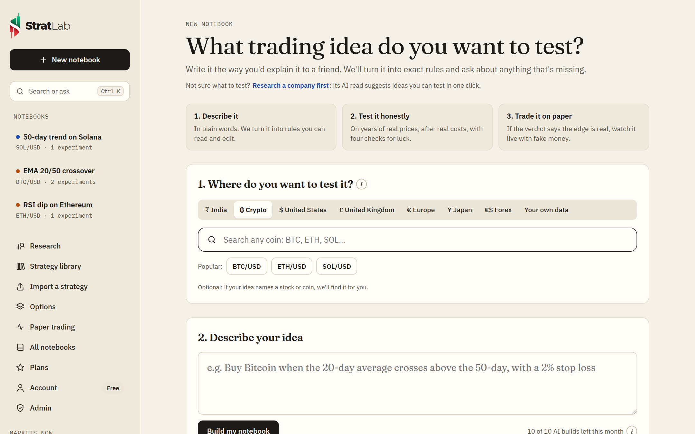
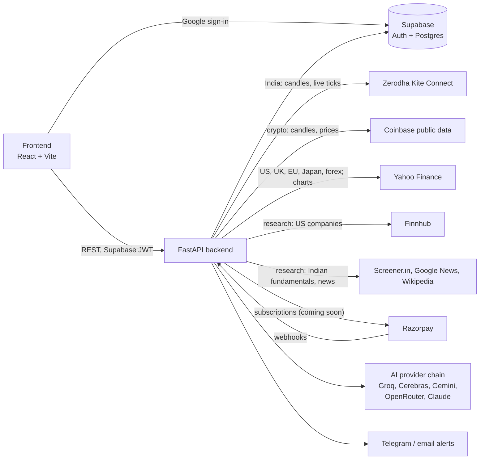

<div align="center">

<picture>
  <source media="(prefers-color-scheme: dark)" srcset="docs/images/logo-dark.png">
  
</picture>

**Test your trading idea before your money does.**

Research a company, describe a strategy in plain English, test it honestly on Indian, US, UK, European and Japanese stocks, forex or crypto, then paper trade it on live prices with fake money.

### [🌐 stratlab.studio](https://stratlab.studio)


</div>

<picture>
  <source media="(prefers-color-scheme: dark)" srcset="docs/images/verdict-dark.png">
  
</picture>

## What makes it different

Most backtesting tools show a flattering chart. StratLab tells you whether the edge is **real or luck**.

- **A verdict on every experiment.** Each test ends in one plain answer: *Likely a real edge*, *Mixed evidence*, *Probably luck*, *Not enough evidence* or *No edge here*. Four checks back it up:
  - **Unseen data:** the rules are tested separately on the last 30% of the period, which they were never tuned on.
  - **Nearby settings:** 25 variations of your indicator lengths. If only your exact numbers make money, that's a lucky fit.
  - **Bad-luck drawdown:** your trades reshuffled 1,000 times, to show how deep the losses could realistically get.
  - **Enough trades:** under 15 trades, luck dominates.
- **Real costs, in the market's own currency.** India: STT, exchange and SEBI fees, stamp duty, GST, plus a capital-gains estimate. US: SEC and FINRA fees. Crypto: exchange fees. You see what you'd actually keep.
- **Lab notebooks.** Each idea is a notebook: a question, the rules written as sentences, numbered experiments you can compare, and your own lab notes.
- **Any market.** Indian stocks, indices and F&O (Zerodha Kite), US, UK, European and Japanese stocks and ETFs and forex (Yahoo Finance), crypto (Coinbase), or upload a CSV of candles from anywhere. No extra keys needed.
- **Research built in.** Company pages for India and the US: live price and chart, valuation and growth with context, sales and profit history, results against estimates, who owns it, insider trades, news, and an AI read whose trading ideas open as a notebook in one click. Plus AI theme maps, a daily market pulse, side-by-side comparisons and a watchlist.
- **Plain-English builder.** Describe the idea; the AI turns it into rules and asks only about what you left out. It tries several free models in turn (Groq, Cerebras, Gemini, OpenRouter), with Claude as an optional fallback, and a simple built-in converter if all of them are down.
- **Paper trading.** Run the rules on live prices with fake money: Indian markets during market hours, crypto around the clock.

<picture>
  <source media="(prefers-color-scheme: dark)" srcset="docs/images/notebook-dark.png">
  
</picture>

<picture>
  <source media="(prefers-color-scheme: dark)" srcset="docs/images/research-dark.png">
  
</picture>

## Everything you can do, and where to find it

New here? A short tour pops up the first time you sign in. You can reopen it any time from **What can I do here?** in the sidebar.

<picture>
  <source media="(prefers-color-scheme: dark)" srcset="docs/images/tour-dark.png">
  
</picture>

| You want to… | Where it is |
| --- | --- |
| Find an idea | **Research a company** in the sidebar: a company's AI read ends with ideas to test in one click |
| Explore a sector | **Research → Themes**: a map of who's involved, where the margin sits, and a ranked shortlist |
| See the market's mood | **Research → Market pulse**: index levels, headlines and an AI read of what's moving |
| Keep an eye on companies | **Watch** on a company page; they're listed under **Research → Watchlist** |
| Test a new idea | **New notebook**: pick the market first, then describe the idea or start from a classic one |
| Choose or change the market | Step 1 on a new notebook, or the **Testing on** button at the top of any notebook |
| Rewrite the idea from scratch | **Describe the idea again** at the top of a notebook |
| Tweak a rule | Tap any highlighted word (marked ▾) in **The rules**: indicator, length, condition or number |
| Run a test | **Run experiment** in a notebook; each run is saved and numbered so you can compare |
| Short instead of buy | Tap **Buy** at the start of the rules and pick **Sell short** |
| Trail the stop or cap how long a trade lasts | The **Trail the stop by … and close any trade after …** line in **The rules** |
| Compare two runs | **Compare experiments →** in a notebook, or **Compare with the previous run** on a verdict |
| Check it isn't one lucky chart | **Does it work on similar stocks?** on a verdict runs the same rules on about 10 similar instruments |
| Understand a number | Every check, stat and setting has an **(i)** button that explains it in plain words |
| Decide what to do next | The **Next** bar on a verdict: change the rules, try another market, paper trade, write a lab note |
| Paper trade | **Paper trade** at the top of a notebook or verdict; running sessions are under **Paper trading** |
| Share or save | **Share verdict** saves an image; **Export** saves the rules as a file |
| Check that everything's connected | **Account → Connection check** shows market data and each AI provider |
| Read at night | **Night mode** at the bottom of the sidebar |

<picture>
  <source media="(prefers-color-scheme: dark)" srcset="docs/images/new-dark.png">
  
</picture>

<sub>Screenshots use synthetic sample prices, not real market data.</sub>

## How it works



The browser only talks to the backend. The backend owns every secret: the Supabase service key, Kite and Razorpay credentials, and the AI keys. Backtests, verdict checks and live paper trading all use the same engine, so a strategy behaves the same everywhere.

## Repository layout

```
stratlab/
├── backend/                  FastAPI app (deploys to Railway)
│   ├── app/
│   │   ├── main.py           API routes
│   │   ├── engine/
│   │   │   ├── core.py       rule evaluation and the trading engine
│   │   │   ├── indicators.py SMA, EMA, RSI, MACD, Bollinger, VWAP, Supertrend, ADX, Stochastic, Donchian
│   │   │   ├── costs.py      per-market trading costs and tax estimates
│   │   │   └── verdict.py    the four honesty checks and the verdict
│   │   ├── basket.py         "does it work on similar stocks?": same rules on ~10 similar instruments
│   │   ├── data/             market data: markets list, Coinbase (crypto), Yahoo (US, UK, EU, Japan, forex)
│   │   ├── intel/            research: Finnhub, Yahoo, Screener.in, news, Wikipedia, AI reads, /research API
│   │   ├── research.py       load candles, run an experiment, keep a compact record
│   │   ├── live.py           paper trading on live ticks (India) or polled candles (crypto)
│   │   ├── kite_service.py   Zerodha Kite Connect
│   │   ├── kite_auto.py      optional automatic daily Kite login
│   │   ├── billing.py        Razorpay subscriptions
│   │   ├── plans.py          plan limits and prices
│   │   ├── ai_writer.py      plain English → strategy rules
│   │   ├── ai_providers.py   the free AI provider chain (Groq, Cerebras, Gemini, OpenRouter, Claude)
│   │   └── alerts.py         Telegram and email alerts
│   ├── tests/                pytest suite
│   └── .env.example          every setting the server reads
├── frontend/                 React + TypeScript app built with Vite (deploys to Vercel)
│   ├── public/               config.js (API URL, Supabase public key), favicon, app icons, link-preview image
│   └── src/
│       ├── pages/            notebook, verdict, markets, research, paper trading, plans, account, admin
│       ├── components/       rules editor, charts, sidebar, feature tour, logo, share image
│       └── lib/              API client, formatting, rule parser, CSV import, (i) help texts, brand
└── supabase/
    └── schema.sql            tables, row-level security, sign-up trigger
```

## Quick start

```bash
# backend
cd stratlab/backend
python -m venv .venv && source .venv/bin/activate
pip install -r requirements.txt
cp .env.example .env          # fill in Supabase, Kite, Razorpay and AI keys
uvicorn app.main:app --reload --port 8000

# frontend (in another terminal)
cd stratlab/frontend
npm install
npm run dev                   # open http://localhost:5500
```

Run the tests with `cd stratlab/backend && pytest`, and check the frontend with `cd stratlab/frontend && npm run build`.

The **[setup guide](stratlab/README.md)** covers Supabase, Kite Connect (including the automatic daily login), Razorpay, the AI writer, deployment, and how the engine and the verdict work.

## Plans

| | Free | Basic · ₹1,999/mo | Pro · ₹4,900/mo |
|---|---|---|---|
| Experiments (each with a full verdict) | 5 / month | 50 / month | Unlimited |
| AI strategy builds | 10 / month | 100 / month | Unlimited |
| Paper trading | 24-hour trial | 1 strategy | 5 strategies |
| Markets | India, crypto, your own CSV | same | + Indian F&O |
| Indicators | Price, SMA, EMA, RSI | Price, SMA, EMA, RSI | + MACD, Bollinger, VWAP, Supertrend |
| Alerts, export | – | – | ✓ |

Limits live in [`plans.py`](stratlab/backend/app/plans.py) and are enforced on the server. **Paid plans are coming soon:** until Razorpay is connected, everyone is on Free and the Plans page says so.

## What's new

See the [changelog](CHANGELOG.md).

## Disclaimer

StratLab is a research and paper trading tool. It places no real orders and gives no investment advice, and past backtest results don't predict future returns.

## License

Proprietary. © 2026 Prakul Bansal. All rights reserved. See [LICENSE](LICENSE).
