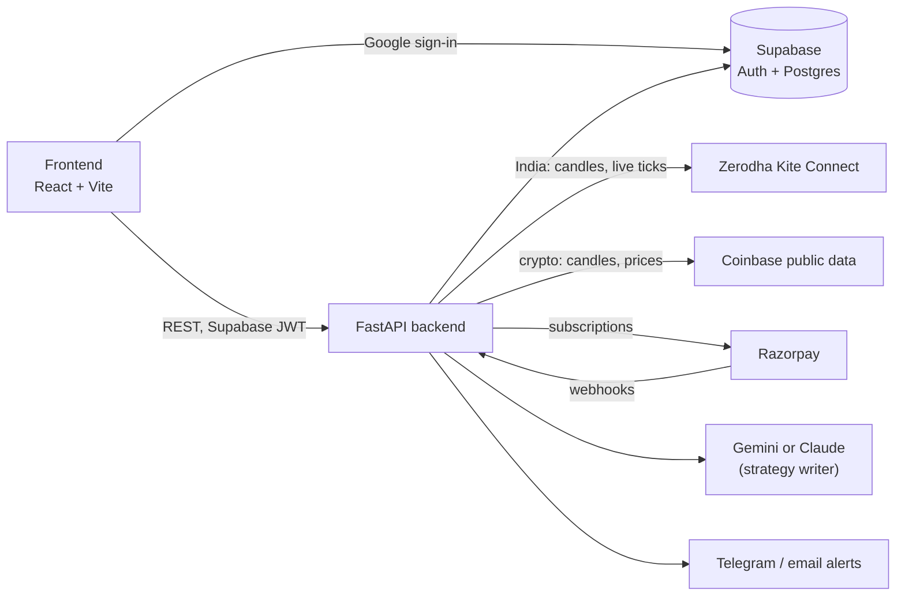

<div align="center">

# StratLab

**Test your trading idea before your money does.**

Describe a strategy in plain English, backtest it on NSE history, then paper trade it on the live market with fake capital.

### [🌐 stratlab.studio](https://stratlab.studio)


</div>

<picture>
  <source media="(prefers-color-scheme: dark)" srcset="docs/images/verdict-dark.png">
  
</picture>

## What makes it different

Most backtesting tools show a flattering chart. StratLab tells you whether the edge is **real or luck**.

- **A verdict on every experiment.** Each test ends in one plain answer: *Likely a real edge*, *Mixed evidence*, *Probably luck*, *Not enough evidence* or *No edge here*. Four checks back it up:
  - **Unseen data:** the rules are tested separately on the last 30% of the period, which they were never tuned on.
  - **Nearby settings:** 25 variations of your indicator lengths. If only your exact numbers make money, that's a lucky fit.
  - **Bad-luck drawdown:** your trades reshuffled 1,000 times, to show how deep the losses could realistically get.
  - **Enough trades:** under 15 trades, luck dominates.
- **Real costs, in the market's own currency.** India: STT, exchange and SEBI fees, stamp duty, GST, plus a capital-gains estimate. US: SEC and FINRA fees. Crypto: exchange fees. You see what you'd actually keep.
- **Lab notebooks.** Each idea is a notebook: a question, the rules written as sentences, numbered experiments you can compare, and your own lab notes.
- **Any market.** Indian stocks, indices and F&O (Zerodha Kite), crypto (Coinbase, no key needed), or upload a CSV of candles from anywhere. US, UK, Europe, Japan and forex are next.
- **Plain-English builder.** Describe the idea; the AI turns it into rules and asks only about what you left out.
- **Paper trading.** Run the rules on live prices with fake money: Indian markets during market hours, crypto around the clock.

<picture>
  <source media="(prefers-color-scheme: dark)" srcset="docs/images/notebook-dark.png">
  
</picture>

<sub>Screenshots use synthetic sample prices, not real market data.</sub>

## How it works



The browser only talks to the backend. The backend owns every secret: the Supabase service key, Kite and Razorpay credentials, and the AI keys. Backtests, verdict checks and live paper trading all use the same engine, so a strategy behaves the same everywhere.

## Repository layout

```
stratlab/
├── backend/                  FastAPI app (deploys to Railway)
│   ├── app/
│   │   ├── main.py           API routes
│   │   ├── engine/
│   │   │   ├── core.py       rule evaluation and the trading engine
│   │   │   ├── indicators.py SMA, EMA, RSI, MACD, Bollinger, VWAP, Supertrend
│   │   │   ├── costs.py      per-market trading costs and tax estimates
│   │   │   └── verdict.py    the four honesty checks and the verdict
│   │   ├── data/             market data: markets list, Kite (India), Coinbase (crypto)
│   │   ├── research.py       load candles, run an experiment, keep a compact record
│   │   ├── live.py           paper trading on live ticks (India) or polled candles (crypto)
│   │   ├── kite_service.py   Zerodha Kite Connect
│   │   ├── kite_auto.py      optional automatic daily Kite login
│   │   ├── billing.py        Razorpay subscriptions
│   │   ├── plans.py          plan limits and prices
│   │   ├── ai_writer.py      plain English → strategy rules
│   │   └── alerts.py         Telegram and email alerts
│   ├── tests/                pytest suite
│   └── .env.example          every setting the server reads
├── frontend/                 React + TypeScript app built with Vite (deploys to Vercel)
│   ├── public/config.js      API URL and Supabase public key, read at runtime
│   └── src/
│       ├── pages/            notebook, verdict, markets, paper trading, plans, account
│       ├── components/       rules editor, charts, sidebar, share image
│       └── lib/              API client, formatting, rule parser, CSV import
└── supabase/
    └── schema.sql            tables, row-level security, sign-up trigger
```

## Quick start

```bash
# backend
cd stratlab/backend
python -m venv .venv && source .venv/bin/activate
pip install -r requirements.txt
cp .env.example .env          # fill in Supabase, Kite, Razorpay and AI keys
uvicorn app.main:app --reload --port 8000

# frontend (in another terminal)
cd stratlab/frontend
npm install
npm run dev                   # open http://localhost:5500
```

Run the tests with `cd stratlab/backend && pytest`, and check the frontend with `cd stratlab/frontend && npm run build`.

The **[setup guide](stratlab/README.md)** covers Supabase, Kite Connect (including the automatic daily login), Razorpay, the AI writer, deployment, and how the engine and the verdict work.

## Plans

| | Free | Basic · ₹1,999/mo | Pro · ₹4,900/mo |
|---|---|---|---|
| Experiments (each with a full verdict) | 5 / month | 50 / month | Unlimited |
| AI strategy builds | 10 / month | 100 / month | Unlimited |
| Paper trading | 24-hour trial | 1 strategy | 5 strategies |
| Markets | India, crypto, your own CSV | same | + Indian F&O |
| Indicators | Price, SMA, EMA, RSI | Price, SMA, EMA, RSI | + MACD, Bollinger, VWAP, Supertrend |
| Alerts, export | – | – | ✓ |

Limits live in [`plans.py`](stratlab/backend/app/plans.py) and are enforced on the server.

## Disclaimer

StratLab is a research and paper trading tool. It places no real orders and gives no investment advice, and past backtest results don't predict future returns.

## License

Proprietary. © 2026 Prakul Bansal. All rights reserved. See [LICENSE](LICENSE).
