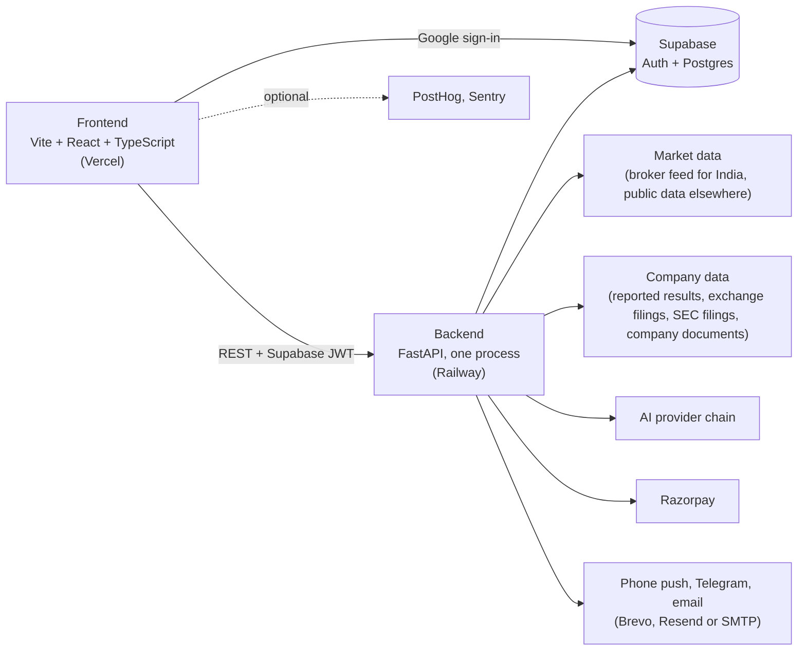

<div align="center">

<picture>
  <source media="(prefers-color-scheme: dark)" srcset="docs/images/logo-dark.png">
  
</picture>

**Know the company. Test the idea.**

Company research, holdings and a capital gains report, stock alerts, and honest strategy backtests with paper trading,
for Indian (NSE and BSE) and US stocks. Facts, never tips.

### [stratlab.studio](https://stratlab.studio)


</div>

<picture>
  <source media="(prefers-color-scheme: dark)" srcset="docs/screenshots/landing-dark.png">
  
</picture>

## What it is

StratLab is one place to understand a listed company, keep track of what you own, hear when something changes, and
find out whether a trading idea has a real edge before any money is at risk.

- **Facts, not advice.** Every number comes from reported results, exchange filings, the company's own documents or
  prices. StratLab never says buy, sell or hold, gives no price targets, ratings or quality scores, and never ranks
  stocks. AI summaries restate the facts and nothing more.
- **Honest backtests.** Every strategy test ends in a plain verdict (*Likely a real edge* to *No edge here*) backed by
  four checks: unseen data, nearby settings, bad-luck drawdown and enough trades.
- **Paper trading only.** No real orders are ever placed.

## Features

The full list, with where each thing lives in the app, is in **[docs/FEATURES.md](docs/FEATURES.md)**.

**Research**
- Company pages for every Indian (NSE, and BSE-only) and US company, plus public facts pages at `/stocks/in/SYMBOL` and `/stocks/us/SYMBOL` for search engines.
- Deep dive: ten years of numbers, the business and its plans read from the company's own presentations, calls or 10-K, industry measures, valuation on the yardstick its industry uses, a management report card, an investor checklist, and the whole thing as PowerPoint or PDF slides.
- Results calendar, corporate actions (dividends, bonuses, splits, buybacks, rights, demergers), deals and insider trades (including bulk and block deals), exchange surveillance lists (ASM, GSM, ESM, trade-to-trade, price bands, F&O ban), and filings with red flags.
- Screens on plain facts, the Stage 2 + Supertrend scan, sector rotation, a watchlist and Watchlist at a glance, themes, market pulse, compare, News, and Markets now.

**Portfolio and tax**
- My Holdings: import the holdings file from Zerodha, Groww, Upstox, Angel One, ICICI Direct or HDFC Securities (or any CSV or Excel file), with value, P&L, sectors, dividends and one-click bonus and split adjustments.
- Tax report: capital gains on listed Indian shares from tradebooks, tax P&L files or the broker's ZIP of them, matched FIFO with the July 2024 rates, the yearly exemption, 2018 grandfathering and intraday apart; CSV and PDF downloads. An estimate, not tax advice.
- Share cards for a company's facts, and invite rewards (a free month of Basic for both once a friend is active).

**Strategy testing**
- Notebooks: describe an idea in plain English (or Ask with Ctrl+K), tap any word to change a rule, run numbered experiments, compare them.
- Real costs per market, long/short/intraday rules, 20+ indicators, walk-forward tests, the similar-stocks check, group tests with one pot of capital, imports from Pine Script, Python, MetaTrader, AmiBroker and configs.
- Paper trading on live prices in every market, options structures at the real bid and ask, a strategy library, and share cards and public links for verdicts.
- Markets: India (stocks, indices, F&O), Indian currency futures, MCX, crypto, US, UK, Europe, Japan, forex, global commodities, and any CSV.

**Alerts**
- Stock alerts (price, day move, moving average, RSI, Stage, 52-week high or low; for India, insider trades, deals and surveillance), results and corporate-action messages, the red-flag and Stage 2 alerts, every paper trade and a daily report, the Market Brief and My Stocks newsletters, and a weekly email per saved screen.
- By phone notification (install from the browser), Telegram or email to a confirmed address.

**Getting started:** a first-steps checklist on Home (a backtest, a watchlist, a deep dive, paper trading, alerts) and a short tour.

<picture>
  <source media="(prefers-color-scheme: dark)" srcset="docs/images/deepdive-dark.png">
  
</picture>

<picture>
  <source media="(prefers-color-scheme: dark)" srcset="docs/images/verdict-dark.png">
  
</picture>

<picture>
  <source media="(prefers-color-scheme: dark)" srcset="docs/screenshots/pricing-dark.png">
  
</picture>

<picture>
  <source media="(prefers-color-scheme: dark)" srcset="docs/screenshots/portfolio-dark.png">
  
</picture>

More screenshots are in [docs/images](docs/images) and [docs/screenshots](docs/screenshots). <sub>Screenshots use synthetic sample data, not real market data.</sub>

## Plans

Limits live in [`plans.py`](stratlab/backend/app/plans.py) and are enforced on the server. The website's copy of them,
[`frontend/src/lib/plans.ts`](stratlab/frontend/src/lib/plans.ts), is checked against it by
`backend/tests/test_plan_copy.py`, and the landing page's e2e test checks the plans it shows against the server's.

| | Free | Basic | Pro |
|---|---|---|---|
| Price (rupee prices include 18% GST) | ₹0 | ₹699 a month (₹6,990 a year) · $8 | ₹1,999 a month (₹19,990 a year) · $20 |
| Backtests, each with a verdict | 10 a month | 100 a month | Unlimited |
| AI strategy builds | 10 a month | 100 a month | Unlimited (a daily safety cap applies) |
| Paper trading | 1 session, for 5 market days | 2 at a time | 10 at a time |
| Instruments in a group test | 10 | 25 | 50 |
| Company deep dives (each company counted once a month) | 2 a month | 15 a month | Unlimited |
| Company slide decks | 1 a month | 5 a month | Unlimited |
| Stock alerts on at once / saved screens / holdings kept | 5 / 2 / 30 | 25 / 10 / 100 | 100 / 25 / 300 |
| All 20+ indicators (Free: price, SMA, EMA, RSI) | – | ✓ | ✓ |
| Group and options paper trading, trade notifications, daily report | – | ✓ | ✓ |
| Stage 2 scan, watchlist red flags, Watchlist at a glance, with alerts | – | ✓ | ✓ |
| Daily Market Brief and My Stocks (weekly for everyone) | – | ✓ | ✓ |
| Indian F&O, options on your own signals, faster group entries, export | – | – | ✓ |
| Every market, company pages, screens, rotation, results, corporate actions, deals, surveillance, red flags on any company, My Holdings, tax report, share cards, invites | ✓ | ✓ | ✓ |

Paid features switch on once Razorpay's keys and monthly plan IDs are set; until then every feature is open to
everyone and only the monthly counts apply. The admin can also run a **launch offer** (Pro for everyone for N days), and
invite rewards give free months of Basic. Visitors outside India see prices in their own currency; every payment gets a
GST invoice.

## Architecture



- **Frontend** (`stratlab/frontend`): a Vite + React 19 + TypeScript single-page app on **Vercel**. Pages load on
  demand. `public/config.js` holds the API address and public keys and is read at runtime. Vercel forwards `/v/*`,
  `/c/*`, `/stocks/*`, `/sitemap.xml` and `/sitemaps/*` to the backend, which renders those public pages itself.
- **Backend** (`stratlab/backend`): **FastAPI** on **Railway**, run as one process, because live paper sessions, the
  tick feed and the scheduled jobs (newsletters, alerts, audits, the daily checks) live in memory. Backtests run in
  worker processes. The backend owns every secret; the browser only talks to it and to Supabase sign-in.
- **Database and sign-in**: **Supabase** (Postgres + Google OAuth). The schema is in `stratlab/supabase/schema.sql`;
  per-user settings and job state live in the `app_settings` key-value table.
- The same engine runs backtests, the verdict checks and live paper trading, so a strategy behaves the same everywhere.

```
stratlab/
├── backend/app/      main.py (routes), engine/ (backtests, costs, verdict, walk-forward), options/, data/ (markets),
│                     intel/ (company research, filings), newsletter/, and one module per feature: deepdive, screens,
│                     holdings, tax_lots, results, corp_actions, deals, surveillance, stock_alerts, invite_rewards…
├── backend/tests/    pytest: units, every route with hostile input, failing sources, tricky dates, security, load
├── frontend/src/     pages/, components/, lib/ (API client, plans, formatting, rules, analytics)
├── frontend/e2e/     Playwright: every page on desktop and phone, every route at several sizes, the landing page
└── supabase/         schema.sql
docs/                 FEATURES.md, ADMIN.md, ROADMAP.md, images/, screenshots/
```

## Local setup

```bash
# backend
cd stratlab/backend
python -m venv .venv && source .venv/bin/activate
pip install -r requirements.txt
cp .env.example .env          # fill in what you need (table below); everything but Supabase is optional
uvicorn app.main:app --reload --port 8000

# frontend (another terminal)
cd stratlab/frontend
npm install
npm run dev                   # http://localhost:5500; point public/config.js at http://localhost:8000
```

The **[setup guide](stratlab/README.md)** walks through Supabase, the broker data API and its daily login, Razorpay,
the AI keys, alerts and deploys.

## Environment variables

Set on the backend (Railway, or `stratlab/backend/.env`). Names and purposes only; never commit values.

| Variable | Purpose |
| --- | --- |
| `SUPABASE_URL`, `SUPABASE_SERVICE_KEY` | The database and sign-in check (service-role key, server only) |
| `KITE_API_KEY`, `KITE_API_SECRET` | The broker market data API for Indian prices, F&O, MCX and live ticks |
| `KITE_USER_ID`, `KITE_PASSWORD`, `KITE_TOTP_SECRET` | Optional automatic daily broker login (off unless all three are set) |
| `KITE_AUTO_LOGIN_AT` | Time of the automatic login, IST (default 08:00) |
| `KITE_RESTART_AFTER_LOGIN` | Restart the live feed after the daily login (default true) |
| `RAZORPAY_KEY_ID`, `RAZORPAY_KEY_SECRET`, `RAZORPAY_WEBHOOK_SECRET` | Payments and the payment webhook |
| `RAZORPAY_PLAN_BASIC`, `RAZORPAY_PLAN_PRO` | Monthly plan IDs; paid features lock to plans once these and the keys are set |
| `RAZORPAY_PLAN_BASIC_YEAR`, `RAZORPAY_PLAN_PRO_YEAR` | Optional yearly plan IDs |
| `AI_PROVIDERS`, `AI_PROVIDERS_RESEARCH`, `AI_PROVIDER` | The order AI providers are tried in, for quick jobs and long research reads |
| `GROQ_API_KEY`, `CEREBRAS_API_KEY`, `SAMBANOVA_API_KEY`, `MISTRAL_API_KEY`, `OPENROUTER_API_KEY`, `GEMINI_API_KEY`, `ANTHROPIC_API_KEY` | AI provider keys; each is used only when set |
| `GROQ_MODEL`, `CEREBRAS_MODEL`, `SAMBANOVA_MODEL`, `MISTRAL_MODEL`, `OPENROUTER_MODEL`, `GEMINI_MODEL`, `ANTHROPIC_MODEL` | Pin a model per provider (`auto` picks one) |
| `FINNHUB_API_KEY` | US company data for the research pages |
| `RESEARCH_AI_PER_DAY` | Fresh AI research reads per user per day (default 60) |
| `TELEGRAM_BOT_TOKEN` | Telegram alerts |
| `ADMIN_TELEGRAM_CHAT_ID` | Where a failed automatic login is reported |
| `BREVO_API_KEY`, `RESEND_API_KEY` | Email over HTTPS, tried in that order |
| `SMTP_HOST`, `SMTP_PORT`, `SMTP_USER`, `SMTP_PASSWORD` | Email over SMTP, the last resort |
| `ALERT_FROM_EMAIL` | The sender address for every email |
| `MAIL_TOKEN_SECRET` | Signs unsubscribe and confirm links (derived from the service key when unset) |
| `FRONTEND_ORIGIN` | Allowed browser origins for CORS, comma-separated |
| `PUBLIC_SITE_URL` | The public site, for shared links, public pages and sitemaps (default https://stratlab.studio) |
| `PUBLIC_API_URL` | The backend's public address, for links in emails (defaults to `RAILWAY_PUBLIC_DOMAIN` on Railway) |
| `STOCK_PAGE_BUILDS_PER_MINUTE` | Fresh public company pages built a minute (default 6) |
| `ADMIN_EMAILS` | Google addresses that can open Admin |
| `OPTION_SNAPSHOTS`, `OPTION_SNAPSHOT_MINUTES`, `OPTION_SNAPSHOT_KEEP_DAYS` | Which option chains are recorded, how often, and for how long |
| `VAPID_PUBLIC_KEY`, `VAPID_PRIVATE_KEY`, `VAPID_SUBJECT` | Optional own key pair for phone notifications (made automatically otherwise) |
| `SENTRY_DSN`, `SENTRY_ENV` | Optional server error alerts |
| `POSTHOG_KEY`, `POSTHOG_HOST` | Optional server-side usage events (a completed payment) |
| `BACKTEST_PROCESSES` | Backtest worker processes (default 2; 0 runs them in the server process) |
| `HEAVY_SLOTS` | Heavy requests (backtests, scans, document reads) run at once (default 2) |

The frontend's `public/config.js` sets `API_BASE`, `SUPABASE_URL`, `SUPABASE_ANON_KEY` (public), and optionally
`SENTRY_DSN`, `POSTHOG_KEY`, `POSTHOG_HOST`, `BUSINESS_NAME`, `CONTACT_EMAIL` and `BUSINESS_ADDRESS`.

## Tests

```bash
# backend: the whole suite (~8 minutes; add -n auto with pytest-xdist)
cd stratlab/backend && python -m pytest -q

# frontend: typecheck and production build
cd stratlab/frontend && npx tsc --noEmit && npx vite build

# browser tests (Playwright) against the backend's fake world; E2E_API_PORT / E2E_WEB_PORT move the servers
cd stratlab/frontend && npx playwright test
```

- **Backend:** units for every module, every route called with hostile input (`test_stress_fuzz.py`: no route may
  return a 500), every data source failing in every way it fails in real life, the app at tricky moments (holidays,
  expiry days, midnight IST), a security sweep (sign-in, admin-only routes, other users' data), and a load test.
- **Browser:** every main page on desktop and phone (no errors, no broken numbers, nothing wider than the screen,
  every control at least 32px tall on a phone), every route at five screen sizes in light and dark
  (`E2E_ALL_SIZES=1` sweeps ten, 320 to 1920 px), a new user's first session, and the landing page's sections and plans.
- **On live data:** **Check every feature** runs daily at 4:50 pm IST, and the whole-market audit checks every new
  listing. See [docs/ADMIN.md](docs/ADMIN.md).

## Deploy

- **Backend → Railway**, one process: `uvicorn app.main:app --host 0.0.0.0 --port $PORT`.
- **Frontend → Vercel**, root `stratlab/frontend`; `vercel.json` sets the build (`npm run build`, output `dist`),
  security headers, the CSP and the rewrites to the backend.
- Pull requests merge once the backend, frontend and browser tests pass and the preview builds; Railway and Vercel then
  deploy. Run **Admin → Data checks → Check every feature** after a deploy.

Running it day to day (the Admin page, the audits, email, PostHog, Sentry): **[docs/ADMIN.md](docs/ADMIN.md)**.

## What's new

The [changelog](CHANGELOG.md) lists what shipped, by month; the [roadmap](docs/ROADMAP.md) lists what's next and the
known gaps.

## Disclaimer

StratLab is a research and paper trading tool. It places no real orders and gives no investment advice, and past
backtest results don't predict future returns.

## License

Proprietary. © 2026 Prakul Bansal. All rights reserved. See [LICENSE](LICENSE).
