<div align="center">

<picture>
  <source media="(prefers-color-scheme: dark)" srcset="docs/images/logo-dark.png">
  
</picture>

**Test it, research it, track it.**

Honest strategy backtests with paper trading, company research, and your holdings, funds, net worth and tax, for Indian
(NSE and BSE) and US stocks. Facts, never tips.

### [stratlab.studio](https://stratlab.studio)


</div>

<picture>
  <source media="(prefers-color-scheme: dark)" srcset="docs/screenshots/landing-dark.png">
  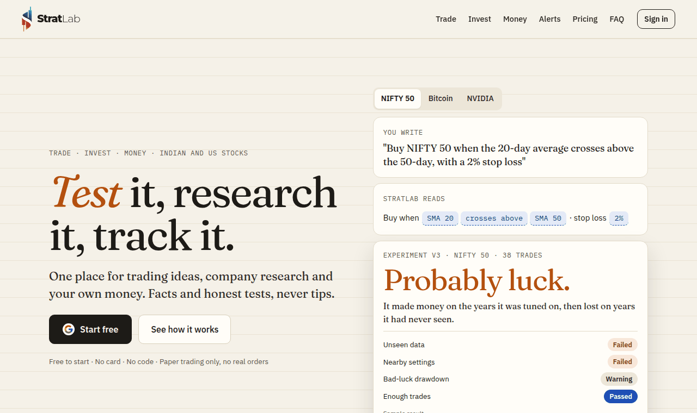
</picture>

## What it is

StratLab is one place to find out whether a trading idea has a real edge before any money is at risk, understand a
listed company, and keep track of what you own and what it means at tax time. It has three spaces, picked at the top of
the menu: **Trade** (the strategy lab), **Invest** (research) and **Money** (your own finances), each with its own home
page.

- **Facts, not advice.** Every number comes from reported results, exchange filings, the company's own documents,
  prices or your own files. StratLab never says buy, sell or hold, gives no price targets, ratings or quality scores,
  and never ranks stocks or funds. AI summaries restate the facts and nothing more.
- **Honest backtests.** Every strategy test ends in a plain verdict (*Likely a real edge* to *No edge here*) backed by
  four checks: unseen data, nearby settings, bad-luck drawdown and enough trades.
- **Paper trading only.** No real orders are ever placed, and no tax return is ever filed.

## Features

The full list, with where each thing lives in the app, is in **[docs/FEATURES.md](docs/FEATURES.md)**.

**Trade: the strategy lab**
- Notebooks: describe an idea in plain English (or Ask with Ctrl+K), tap any word to change a rule, run numbered experiments, compare them.
- Real costs per market, long/short/intraday rules, 20+ indicators, walk-forward tests, the similar-stocks check, group tests with one pot of capital, imports from Pine Script, Python, MetaTrader, AmiBroker and configs.
- Paper trading on live prices in every market, and option structures (up to eight legs) at the real bid and ask. Each session shows today first; earlier trades fold under one line with their total, and each trade's orders open under it.
- Options builder: charges to open and close, breakevens and the most it can make or lose before and after charges, each leg's IV and Greeks, and the payoff today beside the one at expiry, for everyone; what-if sliders (underlying, IV, days) and a roll preview on Pro. Greeks are model estimates, shown with their inputs.
- Each backtest's trades and paper session's stops and targets on the price chart, with the indicators the rules use.
- F&O changes (`/trade/fo-changes`): stocks entering and leaving F&O, lot-size revisions and expiry-day changes in one dated list, with badges and an alert when a change touches your watchlist or paper sessions (Basic).
- Positioning: who holds index and stock futures and options (clients, DIIs, FIIs, proprietary traders; long and short shares), FII/DII cash flows, each index's put-call ratio, max pain, open interest by strike and ATM IV, with their history.
- Trade journal: your real trades from a tradebook or tax P&L (equity and F&O), paired into round trips after charges, with your notes and the verdict's honesty checks run on them.
- A strategy library, and share cards and public links for verdicts.
- Markets: India (stocks, indices, F&O), Indian currency futures, MCX, crypto, US, UK, Europe, Japan, forex, global commodities, and any CSV.

<picture>
  <source media="(prefers-color-scheme: dark)" srcset="docs/screenshots/trade-home-dark.png">
  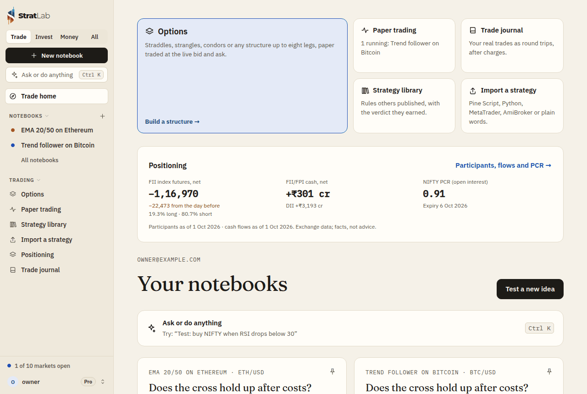
</picture>

<picture>
  <source media="(prefers-color-scheme: dark)" srcset="docs/screenshots/options-session-dark.png">
  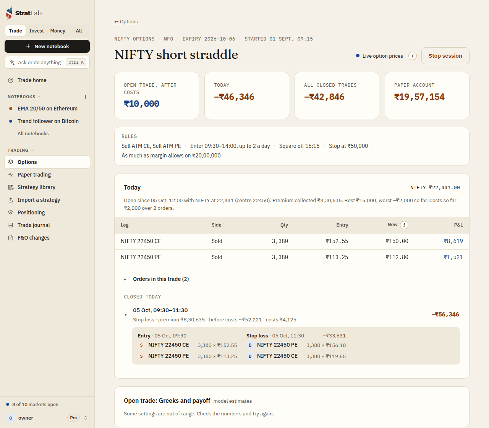
</picture>

<picture>
  <source media="(prefers-color-scheme: dark)" srcset="docs/screenshots/positioning-dark.png">
  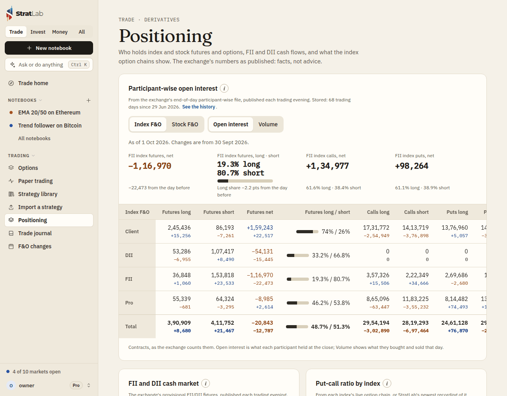
</picture>

<picture>
  <source media="(prefers-color-scheme: dark)" srcset="docs/screenshots/fo-changes-dark.png">
  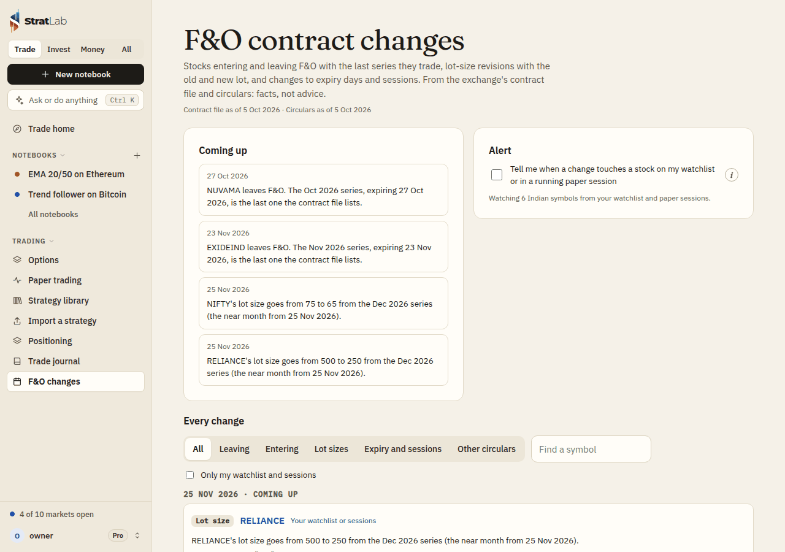
</picture>

<picture>
  <source media="(prefers-color-scheme: dark)" srcset="docs/images/verdict-dark.png">
  
</picture>

**Invest: research**
- Company pages for every Indian (NSE, and BSE-only) and US company, with a price chart (candles, Heikin-Ashi, bars, line; 5 minutes to daily; indicators; drawings kept on your account; compare on a % scale), plus public facts pages at `/stocks/in/SYMBOL` and `/stocks/us/SYMBOL` for search engines.
- Deep dive: ten years of numbers, the business and its plans read from the company's own presentations, calls or 10-K, industry measures, valuation on the yardstick its industry uses, a management report card, an investor checklist, and the whole thing as PowerPoint or PDF slides.
- Results calendar, corporate actions (dividends, bonuses, splits, buybacks, rights, demergers), deals and insider trades (including bulk and block deals), exchange surveillance lists (ASM, GSM, ESM, trade-to-trade, price bands, F&O ban), and filings with red flags.
- ETF vs NAV (`/invest/etf-gaps`): each Indian ETF's price against its last published NAV, widest gap first, with 30 days of history and a gap alert (Basic).
- Screens on plain facts, the Stage 2 + Supertrend scan, sector rotation, market breadth (advances and declines, stocks above their 20/50/200-day averages, new highs and lows, by group and sector), a watchlist and Watchlist at a glance, themes, market pulse, compare, News, and Markets now.

<picture>
  <source media="(prefers-color-scheme: dark)" srcset="docs/screenshots/invest-home-dark.png">
  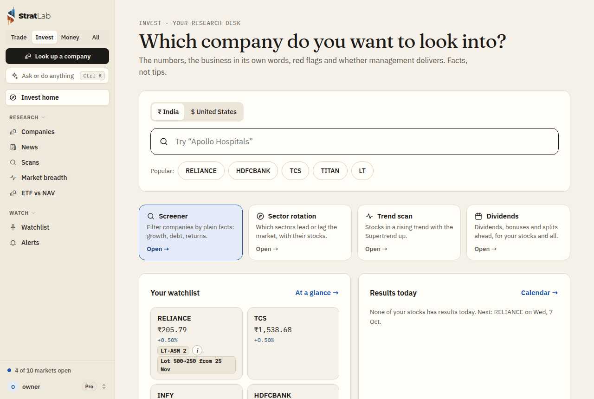
</picture>

<picture>
  <source media="(prefers-color-scheme: dark)" srcset="docs/screenshots/price-chart-dark.png">
  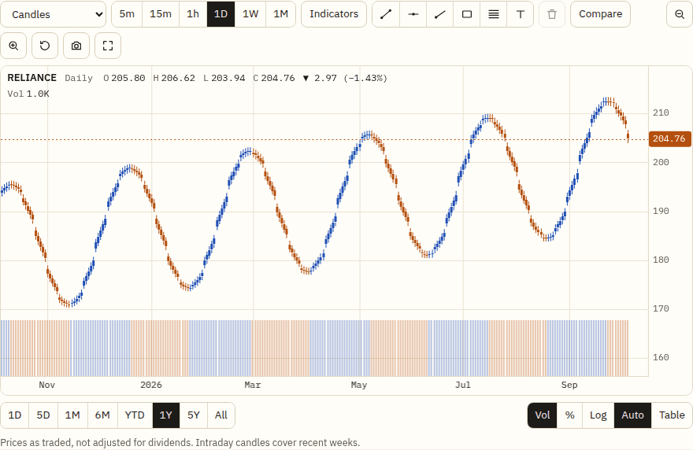
</picture>

<picture>
  <source media="(prefers-color-scheme: dark)" srcset="docs/screenshots/etf-gaps-dark.png">
  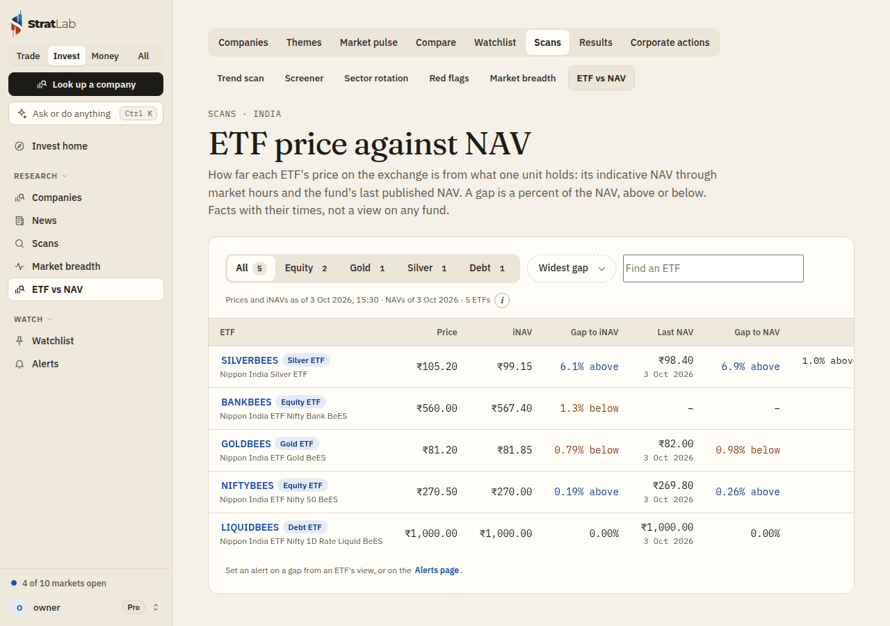
</picture>

<picture>
  <source media="(prefers-color-scheme: dark)" srcset="docs/images/deepdive-dark.png">
  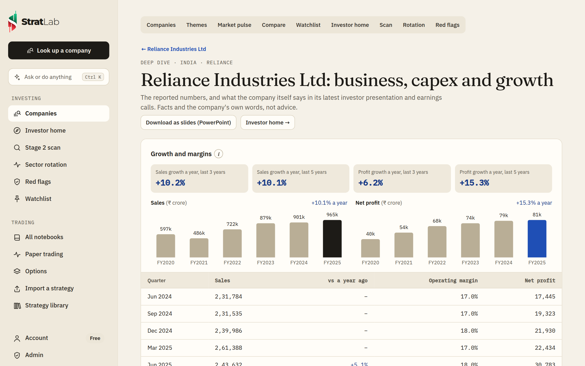
</picture>

**Money: what you own**
- My Holdings: import the holdings file from Zerodha, Groww, Upstox, Angel One, ICICI Direct or HDFC Securities (or any CSV or Excel file), add US stocks, and see value, P&L, sectors, dividends and one-click bonus and split adjustments. ETFs, REITs, InvITs and gold bonds keep their own label.
- Tax report: capital gains on listed Indian shares and funds from tradebooks, tax P&L files or the broker's ZIP of them, matched FIFO with the July 2024 rates, the yearly exemption, 2018 grandfathering and intraday apart; the year's total tax estimate with F&O, commodity and currency results, other income, either regime, age band and residency; CSV and PDF downloads.
- Mutual funds from the CAMS or KFintech CAS PDF: each scheme's value, XIRR, allocation by category and capital gains by year, and what each fund costs: its TER in rupees a year, its parts, the direct and regular plans side by side, and changes since you bought.
- Net worth: holdings and funds plus PF, PPF, NPS, deposits, gold, property and cash, minus loans (EMIs and prepayment arithmetic), an insurance register and a monthly history.
- Tax tools: dividends with TDS, advance tax due by each date (with 234B and 234C) and the long-term exemption, lot by lot.
- US stocks in Indian tax: sales in rupees at the rate the Income-tax Rules use, the 24-month rule, US dividends and the foreign tax credit, and Schedule FA.
- ITR-ready export: the year laid out like the ITR-2 and ITR-3 schedules, as a spreadsheet, CSVs or one PDF for your CA. Not a filed return.
- Money calendar: tax due dates, results and dividends for your stocks, maturities, premiums, EMIs and your own dates, with a private calendar feed and reminders.
- Every estimate states its assumptions and the date it's as of, and each page deletes its data in one step. An estimate to check with a CA, not tax advice.

<picture>
  <source media="(prefers-color-scheme: dark)" srcset="docs/screenshots/money-home-dark.png">
  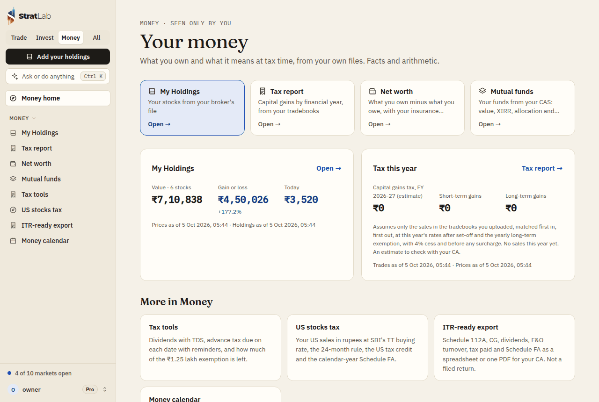
</picture>

**Alerts**
- Stock alerts (price, day move, moving average, RSI, Stage, 52-week high or low; for India, insider trades, deals and surveillance; an ETF's gap to its NAV), F&O contract changes touching your watchlist or paper sessions, results and corporate-action messages, the red-flag and Stage 2 alerts, market breadth crossing a level, every paper trade and a daily report, advance tax and money calendar reminders, the Market Brief and My Stocks newsletters, and a weekly email per saved screen.
- By phone notification (install from the browser), Telegram or email to a confirmed address.

**Getting started:** a first-steps checklist on each space's home (a backtest, a watchlist, a deep dive, paper trading, alerts), a short tour, share cards for a company's facts, and invite rewards (a free month of Basic for both once a friend is active).

More screenshots are in [docs/screenshots](docs/screenshots) and [docs/images](docs/images); `stratlab/frontend/scripts/docs-shots.spec.ts` retakes the ones in docs/screenshots. <sub>Screenshots use synthetic sample data, not real market data.</sub>

## Plans

Limits live in [`plans.py`](stratlab/backend/app/plans.py) and are enforced on the server. The website's copy of them,
[`frontend/src/lib/plans.ts`](stratlab/frontend/src/lib/plans.ts), is checked against it by
`backend/tests/test_plan_copy.py` (prices, limits, and each paid feature named on the card of the plan that adds it),
and the landing page's e2e test checks the plans it shows against the server's.

| | Free | Basic | Pro |
|---|---|---|---|
| Price (rupee prices include 18% GST) | ₹0 | ₹699 a month (₹6,999 a year) · $8 | ₹1,999 a month (₹19,999 a year) · $20 |
| Backtests, each with a verdict | 10 a month | 100 a month | Unlimited |
| AI strategy builds | 10 a month | 100 a month | Unlimited (a daily safety cap applies) |
| Paper trading | 1 session, for 5 market days | 2 at a time | 10 at a time |
| Instruments in a group test | 10 | 25 | 50 |
| Company deep dives (each company counted once a month) | 2 a month | 15 a month | Unlimited |
| Company slide decks | 1 a month | 5 a month | Unlimited |
| Stock alerts on at once / saved screens / holdings kept | 5 / 2 / 30 | 25 / 10 / 100 | 100 / 25 / 300 |
| Mutual fund schemes / Net worth entries / trades the journal keeps | 5 / 5 / 50 | Unlimited | Unlimited |
| All 20+ indicators in strategy rules (Free: price, SMA, EMA, RSI; price charts show every indicator on every plan) | – | ✓ | ✓ |
| Group and options paper trading, trade notifications, daily report | – | ✓ | ✓ |
| Stage 2 scan, watchlist red flags, Watchlist at a glance, with alerts | – | ✓ | ✓ |
| Daily Market Brief and My Stocks (weekly for everyone) | – | ✓ | ✓ |
| Trade journal in full (honesty checks, breakdowns, paper vs real); positioning and market breadth history | – | ✓ | ✓ |
| Mutual fund capital gains, fund costs in rupees (parts, both plans, changes), Net worth history, dividends by company with TDS, money calendar reminders | – | ✓ | ✓ |
| F&O change alerts, ETF gap alerts | – | ✓ | ✓ |
| Indian F&O, options on your own signals, options what-if sliders and roll preview, faster group entries, export | – | – | ✓ |
| Advance tax amounts and the long-term exemption lot by lot, US stocks in Indian tax, the ITR-ready export | – | – | ✓ |
| Every market, company pages and price charts, the options builder with Greeks, the payoff today and breakevens after charges, F&O changes, ETF vs NAV, each fund's TER in rupees, screens, rotation, results, corporate actions, deals, surveillance, red flags on any company, today's positioning and breadth, My Holdings, the tax report and total tax estimate, the money calendar and its feed, share cards, invites | ✓ | ✓ | ✓ |

Paid features switch on once Razorpay's keys and monthly plan IDs are set; until then every feature is open to
everyone and only the monthly counts apply. The admin can also run a **launch offer** (Pro for everyone for N days), and
invite rewards give free months of Basic. Visitors outside India see prices in their own currency; every payment gets a
GST invoice.

<picture>
  <source media="(prefers-color-scheme: dark)" srcset="docs/screenshots/pricing-dark.png">
  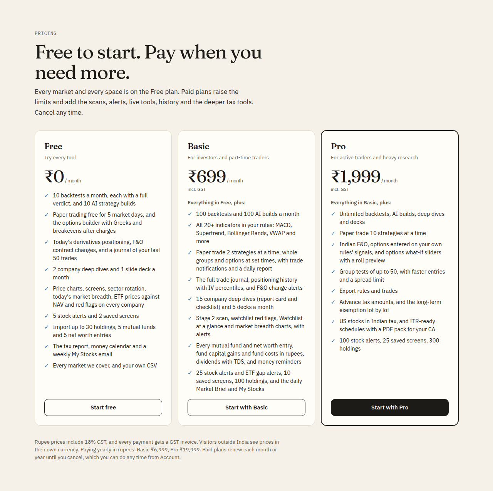
</picture>

## Architecture

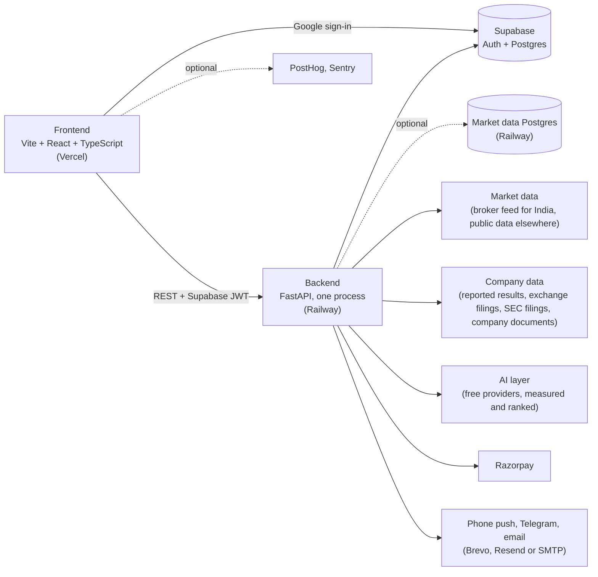

- **Frontend** (`stratlab/frontend`): a Vite + React 19 + TypeScript single-page app on **Vercel**. Pages load on
  demand. `public/config.js` holds the API address and public keys and is read at runtime. Vercel forwards `/v/*`,
  `/c/*`, `/stocks/*`, `/sitemap.xml` and `/sitemaps/*` to the backend, which renders those public pages itself.
- **Backend** (`stratlab/backend`): **FastAPI** on **Railway**, run as one process, because live paper sessions, the
  tick feed and the scheduled jobs (newsletters, alerts, audits, the daily checks) live in memory. Backtests run in
  worker processes. The backend owns every secret; the browser only talks to it and to Supabase sign-in.
- **Database and sign-in**: **Supabase** (Postgres + Google OAuth). The schema is in `stratlab/supabase/schema.sql`;
  per-user settings and job state live in the `app_settings` key-value table. An optional second Postgres
  (`MARKET_DATABASE_URL`) takes the bulky market-wide data, and a nightly GitHub Action keeps an encrypted copy of the
  main database ([docs/ADMIN.md](docs/ADMIN.md#backups)).
- The same engine runs backtests, the verdict checks and live paper trading, so a strategy behaves the same everywhere.
- **AI** goes through one layer (`backend/app/ai_providers.py`) that heals itself: it measures each provider's models
  every few hours, uses the ones that answer correctly and fast, checks every reply, pauses a failing model or provider
  and moves on, and never names a provider to users. Free providers are enough; the admin AI panel shows each one
  ([docs/ADMIN.md](docs/ADMIN.md#ai-providers)).
- **Charts**: one shared chart system (`frontend/src/components/chart/`: crosshair, zoom, ranges, legends, linked charts,
  a table view) draws every chart, and the price chart (`frontend/src/charts/price/`) is StratLab's own canvas engine,
  loaded only on pages that show one.

```
stratlab/
├── backend/app/      main.py (routes), engine/ (backtests, costs, verdict, walk-forward), options/, data/ (markets),
│                     intel/ (company research, filings), newsletter/, and one module per feature: deepdive, screens,
│                     holdings, tax_lots, results, corp_actions, deals, surveillance, stock_alerts, breadth, positioning,
│                     journal, fo_changes, etf_nav, money_* (net worth, funds, fund costs, tax tools, US tax, ITR,
│                     calendar), ai_* (the AI layer: catalog, ranking, providers), storage, invite_rewards…
├── backend/tests/    pytest: units, every route with hostile input, failing sources, tricky dates, security, load
├── frontend/src/     pages/ (trade/, money/ and the rest), components/ (chart/: the shared chart system), charts/price/
│                     (the price chart), lib/ (API client, plans, spaces, Greeks, formatting, analytics)
├── frontend/e2e/     Playwright: every page on desktop and phone, every route at several sizes, the landing page
├── frontend/scripts/ docs-shots: retakes the README's screenshots from the fake world
└── supabase/         schema.sql
docs/                 FEATURES.md, ADMIN.md, ROADMAP.md, images/, screenshots/
```

## Local setup

```bash
# backend
cd stratlab/backend
python -m venv .venv && source .venv/bin/activate
pip install -r requirements.txt
cp .env.example .env          # fill in what you need (table below); everything but Supabase is optional
uvicorn app.main:app --reload --port 8000

# frontend (another terminal)
cd stratlab/frontend
npm install
npm run dev                   # http://localhost:5500; point public/config.js at http://localhost:8000
```

The **[setup guide](stratlab/README.md)** walks through Supabase, the broker data API and its daily login, Razorpay,
the AI keys, alerts and deploys.

## Environment variables

Set on the backend (Railway, or `stratlab/backend/.env`). Names and purposes only; never commit values.

| Variable | Purpose |
| --- | --- |
| `SUPABASE_URL`, `SUPABASE_SERVICE_KEY` | The database and sign-in check (service-role key, server only) |
| `KITE_API_KEY`, `KITE_API_SECRET` | The broker market data API for Indian prices, F&O, MCX and live ticks |
| `KITE_USER_ID`, `KITE_PASSWORD`, `KITE_TOTP_SECRET` | Optional automatic daily broker login (off unless all three are set) |
| `KITE_AUTO_LOGIN_AT` | Time of the automatic login, IST (default 08:00) |
| `KITE_RESTART_AFTER_LOGIN` | Restart the live feed after the daily login (default true) |
| `RAZORPAY_KEY_ID`, `RAZORPAY_KEY_SECRET`, `RAZORPAY_WEBHOOK_SECRET` | Payments and the payment webhook |
| `RAZORPAY_PLAN_BASIC`, `RAZORPAY_PLAN_PRO` | Monthly plan IDs; paid features lock to plans once these and the keys are set |
| `RAZORPAY_PLAN_BASIC_YEAR`, `RAZORPAY_PLAN_PRO_YEAR` | Optional yearly plan IDs |
| `AI_PROVIDERS`, `AI_PROVIDERS_RESEARCH`, `AI_PROVIDER` | The order AI providers are tried in, for quick jobs and long research reads |
| `GROQ_API_KEY`, `CEREBRAS_API_KEY`, `SAMBANOVA_API_KEY`, `MISTRAL_API_KEY`, `OPENROUTER_API_KEY`, `GEMINI_API_KEY`, `ANTHROPIC_API_KEY` | AI provider keys; each is used only when set |
| `CLOUDFLARE_API_TOKEN` + `CLOUDFLARE_ACCOUNT_ID`, `ZAI_API_KEY`, `HF_TOKEN`, `AI_GATEWAY_API_KEY`, `GITHUB_MODELS_TOKEN`, `NVIDIA_API_KEY` | More optional free AI providers; free limits, terms and key links in [docs/ADMIN.md](docs/ADMIN.md#ai-providers) |
| `GROQ_MODEL`, `CEREBRAS_MODEL`, `SAMBANOVA_MODEL`, `MISTRAL_MODEL`, `OPENROUTER_MODEL`, `GEMINI_MODEL`, `ANTHROPIC_MODEL`, `CLOUDFLARE_MODEL`, `ZAI_MODEL`, `HUGGINGFACE_MODEL`, `AI_GATEWAY_MODEL`, `GITHUB_MODEL`, `NVIDIA_MODEL` | Pin a model per provider (`auto`, the default, uses the models the server measured) |
| `FINNHUB_API_KEY` | US company data for the research pages |
| `RESEARCH_AI_PER_DAY` | Fresh AI research reads per user per day (default 60) |
| `TELEGRAM_BOT_TOKEN` | Telegram alerts |
| `ADMIN_TELEGRAM_CHAT_ID` | Where a failed automatic login is reported |
| `BREVO_API_KEY`, `RESEND_API_KEY` | Email over HTTPS, tried in that order |
| `SMTP_HOST`, `SMTP_PORT`, `SMTP_USER`, `SMTP_PASSWORD` | Email over SMTP, the last resort |
| `ALERT_FROM_EMAIL` | The sender address for every email |
| `MAIL_TOKEN_SECRET` | Signs unsubscribe and confirm links (derived from the service key when unset) |
| `FRONTEND_ORIGIN` | Allowed browser origins for CORS, comma-separated |
| `PUBLIC_SITE_URL` | The public site, for shared links, public pages and sitemaps (default https://stratlab.studio) |
| `PUBLIC_API_URL` | The backend's public address, for links in emails (defaults to `RAILWAY_PUBLIC_DOMAIN` on Railway) |
| `STOCK_PAGE_BUILDS_PER_MINUTE` | Fresh public company pages built a minute (default 6) |
| `ADMIN_EMAILS` | Google addresses that can open Admin |
| `OPTION_SNAPSHOTS`, `OPTION_SNAPSHOT_MINUTES`, `OPTION_SNAPSHOT_KEEP_DAYS` | Which option chains are recorded (NIFTY, BANKNIFTY, FINNIFTY, MIDCPNIFTY and SENSEX by default), how often, and for how long |
| `MARKET_DATABASE_URL` | Optional second Postgres for the bulky market-wide data (see [docs/ADMIN.md](docs/ADMIN.md#storage)) |
| `DB_LIMIT_MB` | The main database's size limit for the storage warning (default 500, Supabase's free plan) |
| `VAPID_PUBLIC_KEY`, `VAPID_PRIVATE_KEY`, `VAPID_SUBJECT` | Optional own key pair for phone notifications (made automatically otherwise) |
| `SENTRY_DSN`, `SENTRY_ENV` | Optional server error alerts |
| `POSTHOG_KEY`, `POSTHOG_HOST` | Optional server-side usage events (a completed payment) |
| `BACKTEST_PROCESSES` | Backtest worker processes (default 2; 0 runs them in the server process) |
| `HEAVY_SLOTS` | Heavy requests (backtests, scans, document reads) run at once (default 2) |

The frontend's `public/config.js` sets `API_BASE`, `SUPABASE_URL`, `SUPABASE_ANON_KEY` (public), and optionally
`SENTRY_DSN`, `POSTHOG_KEY`, `POSTHOG_HOST`, `BUSINESS_NAME`, `CONTACT_EMAIL` and `BUSINESS_ADDRESS`.

## Tests

```bash
# backend: the whole suite (~8 minutes; add -n auto with pytest-xdist)
cd stratlab/backend && python -m pytest -q

# frontend: typecheck and production build
cd stratlab/frontend && npx tsc --noEmit && npx vite build

# browser tests (Playwright) against the backend's fake world; E2E_API_PORT / E2E_WEB_PORT move the servers
cd stratlab/frontend && npx playwright test
```

- **Backend:** units for every module, every route called with hostile input (`test_stress_fuzz.py`: no route may
  return a 500), every data source failing in every way it fails in real life, the app at tricky moments (holidays,
  expiry days, midnight IST), a security sweep (sign-in, admin-only routes, other users' data), and a load test.
- **Browser:** every main page on desktop and phone (no errors, no broken numbers, nothing wider than the screen,
  every control at least 32px tall on a phone), every route at five screen sizes in light and dark
  (`E2E_ALL_SIZES=1` sweeps ten, 320 to 1920 px), a new user's first session, and the landing page's sections and plans.
- **On live data:** **Check every feature** runs daily at 4:50 pm IST, and the whole-market audit checks every new
  listing. See [docs/ADMIN.md](docs/ADMIN.md).
- **On GitHub** (`.github/workflows/tests.yml`, Node 22 and Python 3.11 on Ubuntu 24.04): the backend suite in parallel
  and the frontend build side by side, then the browser tests on the built site; a newer push cancels the run before it.
- **Screenshots:** `npx playwright test -c scripts/docs-shots.config.ts` (from `stratlab/frontend`, after a build)
  retakes the README's pictures in `docs/screenshots` from the same fake world.

## Deploy

- **Backend → Railway**, one process: `uvicorn app.main:app --host 0.0.0.0 --port $PORT`.
- **Frontend → Vercel**, root `stratlab/frontend`; `vercel.json` sets the build (`npm run build`, output `dist`),
  security headers, the CSP and the rewrites to the backend.
- Pull requests merge once the backend, frontend and browser tests pass and the preview builds; Railway and Vercel then
  deploy. Run **Admin → Data checks → Check every feature** after a deploy.
- **Backups:** a GitHub Action copies the main database every night at 02:10 IST, encrypted
  ([docs/ADMIN.md](docs/ADMIN.md#backups)).

Running it day to day (the Admin page, the audits, email, PostHog, Sentry): **[docs/ADMIN.md](docs/ADMIN.md)**.

## What's new

The [changelog](CHANGELOG.md) lists what shipped, by month; the [roadmap](docs/ROADMAP.md) lists what's next and the
known gaps.

## Disclaimer

StratLab is a research and paper trading tool. It places no real orders and gives no investment advice, and past
backtest results don't predict future returns.

## License

Proprietary. © 2026 Prakul Bansal. All rights reserved. See [LICENSE](LICENSE).
