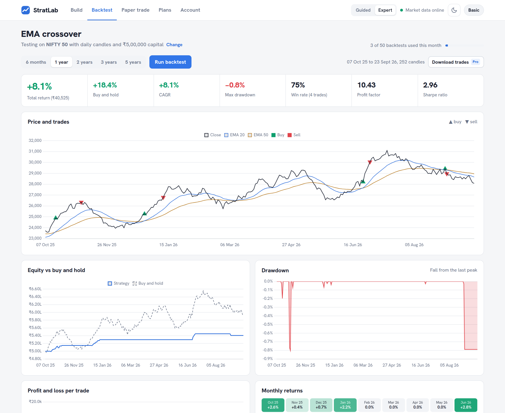
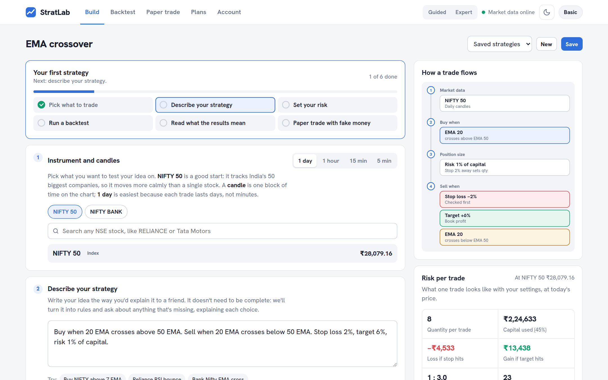
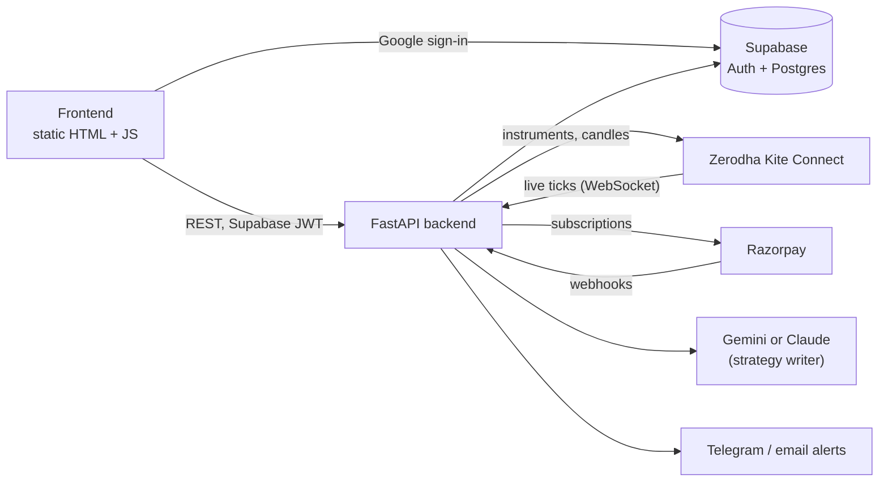

<div align="center">

# StratLab

**Test your trading idea before your money does.**

Describe a strategy in plain English, backtest it on NSE history, then paper trade it on the live market with fake capital.

### [🌐 stratlab.studio](https://stratlab.studio)


</div>

<picture>
  <source media="(prefers-color-scheme: dark)" srcset="docs/images/backtest-dark.png">
  
</picture>

## Features

- **Plain-English strategy builder.** Type something like *"Buy when the 20 EMA crosses above the 50 EMA, stop loss 2%"*. The AI turns it into rules and asks about anything missing, such as the exit, timeframe or risk.
- **Backtests on NSE data.** Covers Nifty 50, Bank Nifty, any NSE stock and F&O, on daily, hourly, 15-minute or 5-minute candles. Results show return, CAGR, drawdown, win rate, profit factor, Sharpe ratio, every trade and a buy-and-hold comparison.
- **Live paper trading.** The same engine runs on live Kite ticks during market hours, with fake capital, and can send trade alerts on Telegram or email.
- **Risk-first position sizing.** Quantity = (capital × risk %) ÷ distance to the stop, capped per trade, rounded to whole lots for F&O, with brokerage and slippage on every order.
- **Guided and Expert modes.** Beginners get explanations at every step; experienced traders get every control.
- **Subscriptions.** Free, Basic and Pro plans billed through Razorpay, with limits enforced on the server.

<picture>
  <source media="(prefers-color-scheme: dark)" srcset="docs/images/build-dark.png">
  
</picture>

<sub>Screenshots use synthetic sample prices, not real market data.</sub>

## How it works



The browser only talks to the backend. The backend owns every secret: the Supabase service key, Kite and Razorpay credentials, and the AI keys. Backtests and live paper trading use the same engine, so a strategy behaves the same in both.

## Repository layout

```
stratlab/
├── backend/                FastAPI app (deploys to Railway)
│   ├── app/
│   │   ├── main.py         API routes
│   │   ├── engine/         indicators, rule evaluation, backtest engine
│   │   ├── live.py         live paper trading on Kite ticks
│   │   ├── kite_service.py market data (Kite Connect)
│   │   ├── kite_auto.py    optional automatic daily Kite login
│   │   ├── billing.py      Razorpay subscriptions and webhooks
│   │   ├── plans.py        plan limits and prices
│   │   ├── ai_writer.py    plain English → strategy rules
│   │   └── alerts.py       Telegram and email alerts
│   ├── tests/              pytest suite
│   └── .env.example        every setting the server reads
├── frontend/               single-page app (deploys to Vercel or Netlify)
│   ├── index.html
│   └── config.js           API URL and Supabase public key
└── supabase/
    └── schema.sql          tables, row-level security, sign-up trigger
```

## Quick start

```bash
# backend
cd stratlab/backend
python -m venv .venv && source .venv/bin/activate
pip install -r requirements.txt
cp .env.example .env          # fill in Supabase, Kite, Razorpay and AI keys
uvicorn app.main:app --reload --port 8000

# frontend (in another terminal)
cd stratlab/frontend
python -m http.server 5500    # open http://localhost:5500
```

Run the tests with `cd stratlab/backend && pytest`.

The **[setup guide](stratlab/README.md)** covers Supabase, Kite Connect (including the automatic daily login), Razorpay, the AI writer, deployment and how the engine works.

## Plans

| | Free | Basic · ₹1,999/mo | Pro · ₹4,900/mo |
|---|---|---|---|
| Backtests | 5 / month | 50 / month | Unlimited |
| AI strategy builds | 10 / month | 100 / month | Unlimited |
| Live paper trading | 24-hour trial | 1 strategy | 5 strategies |
| Indicators | Price, SMA, EMA, RSI | Price, SMA, EMA, RSI | + MACD, Bollinger, VWAP, Supertrend |
| F&O, alerts, export | – | – | ✓ |

Limits live in [`plans.py`](stratlab/backend/app/plans.py) and are enforced on the server.

## Disclaimer

StratLab is a research and paper trading tool. It places no real orders and gives no investment advice, and past backtest results don't predict future returns.
